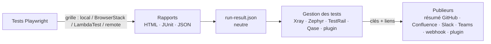

# Intégrations — Mode opératoire

> S'applique à : Playwright Enterprise Kit avec la couche `integrations/` | Mis à jour : 2026-10-05
> English version: [integrations.md](./integrations.md)

Le kit fonctionne **seul** (navigateurs locaux, rapports HTML/JUnit/JSON) et peut être **branché sur n'importe quel outil** grâce à de petits *fournisseurs* (providers) interchangeables. Jira/Xray, Confluence et BrowserStack restent entièrement supportés et se comportent exactement comme avant : ce sont désormais des fournisseurs parmi d'autres.

---

## Sommaire

1. [Concepts](#1-concepts)
2. [Démarrage en 5 minutes, sans aucun outil tiers](#2-démarrage-en-5-minutes-sans-aucun-outil-tiers)
3. [Comment les fournisseurs sont sélectionnés](#3-comment-les-fournisseurs-sont-sélectionnés)
4. [Grilles d'exécution](#4-grilles-dexécution)
5. [Outils de gestion des tests](#5-outils-de-gestion-des-tests)
6. [Publieurs (notifications, tableaux de bord)](#6-publieurs-notifications-tableaux-de-bord)
7. [Publier un run : `pek-publish` et `run-result.json`](#7-publier-un-run--pek-publish-et-run-resultjson)
8. [GitHub Actions](#8-github-actions)
9. [Autres CI (GitLab, Jenkins, Azure DevOps)](#9-autres-ci-gitlab-jenkins-azure-devops)
10. [Serveur MCP](#10-serveur-mcp)
11. [Connecter n'importe quel autre système : écrire son fournisseur](#11-connecter-nimporte-quel-autre-système--écrire-son-fournisseur)
12. [Garanties de rétrocompatibilité](#12-garanties-de-rétrocompatibilité)
13. [Dépannage](#13-dépannage)

---

## 1. Concepts

Trois familles de fournisseurs, chacune répond à une question :

| Famille | Question | Fournisseurs intégrés | Par défaut |
|---|---|---|---|
| **grid** | *Où tournent les navigateurs ?* | `local`, `browserstack`, `lambdatest`, `remote` | `local` |
| **test-management** | *Où sont stockés les résultats ?* | `xray`, `zephyr-scale`, `testrail`, `qase` | aucun |
| **publisher** | *Qui est notifié / quel tableau de bord est mis à jour ?* | `github-summary`, `confluence`, `slack`, `teams`, `webhook` | `github-summary` dans GitHub Actions |



À retenir :

- **Rien n'est obligatoire.** Un fournisseur sans identifiants est simplement inactif.
- **Un format commun.** Chaque run produit `run-result.json` (statut, compteurs, environnement, tests, liens). Chaque fournisseur le lit ; aucun ne dépend d'un autre.
- **Les erreurs sont isolées.** Si Slack est indisponible, TestRail reçoit quand même ses résultats, et un problème de notification ne fait pas échouer le job de test.
- **Les scripts existants ne bougent pas.** Les fournisseurs BrowserStack, Xray et Confluence sont de fines couches au-dessus des `scripts/` et fixtures historiques.

Organisation :

```
integrations/
├── index.js                 # registre : sélection, détection auto, plugins
├── lib/
│   ├── run-result.js        # construit run-result.json (JSON Playwright ou JUnit)
│   ├── publish.js           # moteur de publication
│   └── http.js              # helper fetch (timeouts, erreurs lisibles)
├── grids/                   # local, browserstack, lambdatest, remote (+ remote-fixtures.js)
├── test-management/         # xray, zephyr-scale, testrail, qase
├── publishers/              # github-summary, confluence, slack, teams, webhook
├── _template/               # point de départ pour votre propre fournisseur
└── __tests__/               # tests unitaires (npm run test:unit)
pek.config.js                # fichier de sélection optionnel
scripts/pek-publish.js       # CLI : publier le dernier run
scripts/pek-doctor.js        # CLI : ce qui est configuré / actif
playwright.config.grid.js    # config pour les grilles cloud « une session par test » (LambdaTest…)
playwright.config.demo.ts    # config ciblant l'appli de démo fournie
demo-site/ + scripts/demo-server.js  # mini-appli de démo (aucune vraie appli nécessaire)
```

---

## 2. Démarrage en 5 minutes, sans aucun outil tiers

```bash
npm install
npx playwright install chromium

npm run test:demo        # tests d'exemple contre l'appli de démo (démarrée automatiquement)
npm run pek:doctor       # affiche : grille local ACTIVE, toutes les intégrations off
npm run pek:publish      # écrit run-result.json (aucun appel distant)
npm run test:report      # ouvre le rapport HTML
```

Sur votre propre application :

```bash
BASE_URL=https://recette.monappli.com npm test
npm run pek:publish -- --scope "Smoke"
```

C'est le mode « autonome » complet : ni Jira, ni Confluence, ni BrowserStack, ni aucun compte.

> Sous Windows (PowerShell) : `$env:BASE_URL="https://recette.monappli.com"; npm test`

---

## 3. Comment les fournisseurs sont sélectionnés

Pour chaque famille, la première règle applicable l'emporte :

| Priorité | Grille | Gestion des tests | Publieurs |
|---|---|---|---|
| 1. Variable d'environnement | `PEK_GRID` | `PEK_TEST_MANAGEMENT` | `PEK_PUBLISHERS` |
| 2. `pek.config.js` | `grid` | `testManagement` | `publishers` |
| 3. Défaut | `auto` | `auto` | `auto` |

Valeurs :

- `auto` — tous les fournisseurs dont les variables **obligatoires** sont présentes. Pour la grille : `browserstack` > `lambdatest` > `remote` > `local` (le premier configuré gagne).
- `none` — désactive la famille (pour la grille : `local`).
- une liste explicite — `xray,testrail` ou `slack,teams` (un nom inconnu échoue en listant les noms valides).

```js
// pek.config.js (versionné, aucun secret dedans)
module.exports = {
  grid: 'auto',
  testManagement: ['testrail'],
  publishers: ['github-summary', 'slack'],
  plugins: ['./integrations/custom/mon-outil.js'],
};
```

**Vérifier avant de lancer :**

```bash
npm run pek:doctor            # tableau ACTIVE / ready / off + NOMS des variables manquantes
node scripts/pek-doctor.js --json
```

> Les secrets viennent toujours de variables d'environnement (`.env`, secrets CI, config du client MCP). `pek.config.js` ne fait que sélectionner.

---

## 4. Grilles d'exécution

Les tests importent leurs fixtures depuis `test-fixtures` (et non `@playwright/test`) : le même test tourne sur n'importe quelle grille.

```ts
import { test, expect } from '../../test-fixtures';
```

### 4.1 `local` (par défaut)

Navigateurs installés par `npx playwright install`. Tous les projets de `playwright.config.ts` (chromium, firefox, webkit) sont utilisés.

```bash
npm test
npm test -- --project=chromium
```

### 4.2 `browserstack` (inchangé)

Sélectionné automatiquement si `BROWSERSTACK_USERNAME` et `BROWSERSTACK_ACCESS_KEY` sont définis. Tout fonctionne comme décrit dans le README (`browserstack.config.js`, variables `BS_*`, `npm run test:browserstack`, `scripts/resolve-browserstack-config.js`).

### 4.3 `lambdatest`

Une session LambdaTest par test via l'endpoint CDP Playwright de LambdaTest ([doc](https://www.lambdatest.com/support/docs/playwright-testing/)) ; le statut réussi/échoué est remonté dans le tableau de bord LambdaTest.

| Variable | Obligatoire | Exemple / défaut |
|---|---|---|
| `LT_USERNAME`, `LT_ACCESS_KEY` | oui | Profil LambdaTest → Access key |
| `LT_PLATFORM` | non | `Windows 11` (défaut), `Windows 10`, `macOS Sonoma` |
| `LT_BROWSER` | non | `Chrome` (défaut), `MicrosoftEdge`, `pw-chromium`, `pw-firefox`, `pw-webkit` |
| `LT_BROWSER_VERSION` | non | `latest` |
| `LT_BUILD_NAME`, `LT_PROJECT_NAME` | non | affichés dans le tableau de bord |
| `PEK_GRID_WORKERS` | non | `2` sessions en parallèle |

```bash
export LT_USERNAME=... LT_ACCESS_KEY=...
npm run test:grid                      # = playwright test --config=playwright.config.grid.js
```

Si des identifiants BrowserStack sont aussi présents, forcez avec `PEK_GRID=lambdatest`.

### 4.4 `remote` — n'importe quel serveur Playwright

Pour tout endpoint compatible `browserType.connect()` : un `npx playwright run-server` auto-hébergé, l'image Docker officielle `mcr.microsoft.com/playwright`, Browserless, Moon, une grille Kubernetes… Utilise les [`connectOptions`](https://playwright.dev/docs/api/class-testoptions#test-options-connect-options) natives de Playwright : tous les projets continuent de fonctionner.

```bash
# Exemple : un serveur Playwright dans Docker (même version que le @playwright/test du kit)
docker run --rm -p 3000:3000 mcr.microsoft.com/playwright:v1.63.0-noble \
  npx -y playwright@1.63.0 run-server --port 3000 --host 0.0.0.0

PEK_WS_ENDPOINT=ws://localhost:3000/ BASE_URL=https://recette.monappli.com npm test
```

`PEK_WS_HEADERS='{"Authorization":"Bearer xxx"}'` ajoute des en-têtes de connexion si la grille l'exige.

> Sauce Labs exécute Playwright via son propre outil `saucectl` et non via un endpoint de connexion : ce n'est donc pas un fournisseur de grille, mais les résultats produits là-bas peuvent quand même être publiés avec `pek-publish`.

---

## 5. Outils de gestion des tests

Tous sont alimentés par `npm run pek:publish` (ou l'outil MCP `pek_publish_results`). Ils lisent les mêmes rapports, quelle que soit la grille.

### 5.1 `xray` — Xray Cloud (Jira)

| Variable | Obligatoire | Notes |
|---|---|---|
| `XRAY_CLIENT_ID`, `XRAY_CLIENT_SECRET`, `JIRA_PROJECT_KEY` | oui | comme avant |
| `XRAY_TEST_PLAN_KEY` ou `--test-plan` | non | rattache la Test Execution à un Test Plan |
| `JIRA_URL`, `JIRA_USER`, `JIRA_API_TOKEN` | non | active l'enrichissement : titre, labels, champs personnalisés, liens (CI, grille), rapport HTML en pièce jointe |
| `JIRA_CUSTOM_FIELD_*`, `XRAY_ENDPOINT` | non | comme avant |

```bash
npm run pek:publish -- --test-plan MONPROJET-100 --scope "Régression"
```

Mêmes étapes que les scripts CI : `add-timestamps-to-xray-report.js` → `remove-test-keys.js` → import JUnit → enrichissement Jira (équivalent Node de `jira-post-execution.ps1`, sans PowerShell). Le workflow GitHub Actions continue d'utiliser les scripts PowerShell d'origine.

Lier les tests : annotation `test_key`, comme décrit dans le README.

### 5.2 `zephyr-scale` — Zephyr Scale Cloud

Envoie le rapport JUnit et crée un Test Cycle ([doc](https://support.smartbear.com/zephyr-scale-cloud/docs/en/test-automation/upload-test-results.html)).

| Variable | Obligatoire | Notes |
|---|---|---|
| `ZEPHYR_API_TOKEN` | oui | Jira → Zephyr Scale → API access tokens |
| `ZEPHYR_PROJECT_KEY` | oui | clé du projet Jira |
| `ZEPHYR_BASE_URL` | non | instances UE : `https://eu.api.zephyrscale.smartbear.com/v2` |
| `ZEPHYR_AUTO_CREATE_TEST_CASES` | non | `true` (défaut) : les tests inconnus deviennent des cas de test |

Lier les tests : mettre la clé du cas dans le titre, ex. `test('MONPROJET-T12 connexion réussie', …)`.

### 5.3 `testrail` — TestRail

Crée un run avec les cas liés, puis poste un résultat par cas ([API](https://support.testrail.com/hc/en-us/articles/7077083596436-Introduction-to-the-TestRail-API)).

| Variable | Obligatoire | Notes |
|---|---|---|
| `TESTRAIL_URL` | oui | `https://monentreprise.testrail.io` |
| `TESTRAIL_USER`, `TESTRAIL_API_KEY` | oui | My Settings → API Keys (activer l'API dans Administration → Site Settings) |
| `TESTRAIL_PROJECT_ID` | oui | numéro dans l'URL du projet |
| `TESTRAIL_SUITE_ID` | projets multi-suites | |
| `TESTRAIL_RUN_ID` | non | ajoute les résultats à un run existant au lieu d'en créer un |
| `TESTRAIL_CLOSE_RUN` | non | `true` pour clôturer le run ensuite |

Lier les tests — au choix :

```ts
test('C1234 connexion réussie', async ({ page }) => { /* ... */ });

test('déconnexion', async ({ page }) => {
  test.info().annotations.push({ type: 'testrail_case', description: 'C1235' }); // plusieurs : 'C1, C2'
});
```

Correspondance des statuts : réussi/flaky → *Passed*, échoué → *Failed*, ignoré → reste *Untested*. Les tests sans ID de cas sont ignorés.

### 5.4 `qase` — Qase

Crée un run, poste les résultats en masse, clôture le run ([API](https://developers.qase.io/reference/create-run)).

| Variable | Obligatoire | Notes |
|---|---|---|
| `QASE_API_TOKEN` | oui | Qase → Apps → API tokens |
| `QASE_PROJECT_CODE` | oui | ex. `DEMO` |
| `QASE_RUN_ID` | non | réutilise un run existant (il n'est alors pas clôturé) |
| `QASE_COMPLETE_RUN` | non | `false` pour laisser le run créé ouvert |
| `QASE_BASE_URL`, `QASE_APP_URL` | non | instances auto-hébergées / régionales |

Lier les tests : `test.info().annotations.push({ type: 'qase_id', description: '42' })` ou la convention de titre du reporter officiel `"connexion réussie (Qase ID: 42)"`.

---

## 6. Publieurs (notifications, tableaux de bord)

Les publieurs passent **après** la gestion des tests : leurs messages contiennent donc les clés et liens créés (exécution Xray, run TestRail, build BrowserStack, run CI…).

### 6.1 `github-summary`

Activé automatiquement dans GitHub Actions : tableau Markdown (compteurs, environnement, liens, liste repliable des échecs) dans l'onglet *Summary* du job.

### 6.2 `confluence` (inchangé)

Enveloppe `scripts/update-confluence-report.js`. Mêmes variables qu'avant (`CONFLUENCE_URL` se terminant par `/wiki`, `CONFLUENCE_USER`, `CONFLUENCE_API_TOKEN`, `CONFLUENCE_SPACE_KEY`…). Si Xray a tourné dans la même publication, sa clé est reportée dans la ligne du tableau ; le lien de grille remplit la colonne *BrowserStack*.

### 6.3 `slack`

1. Créer une app Slack → *Incoming Webhooks* → *Add New Webhook to Workspace* → choisir le canal ([doc](https://docs.slack.dev/messaging/sending-messages-using-incoming-webhooks)).
2. `SLACK_WEBHOOK_URL=https://hooks.slack.com/services/...`
3. Optionnel : `SLACK_NOTIFY_ON=failure` pour ne rien envoyer quand tout est vert.

### 6.4 `teams`

1. Dans le canal Teams : *Workflows* → modèle **« Publier dans un canal lorsqu'une requête webhook est reçue »** → copier l'URL HTTP ([doc](https://learn.microsoft.com/fr-fr/microsoftteams/platform/webhooks-and-connectors/how-to/add-incoming-webhook)).
2. `TEAMS_WEBHOOK_URL=<cette URL>` — une Adaptive Card est publiée (statut, compteurs, échecs, boutons vers les liens).
3. Optionnel : `TEAMS_NOTIFY_ON=failure`.

### 6.5 `webhook` — l'adaptateur universel

Envoie (POST) tout `run-result.json` vers n'importe quelle URL : n8n, Zapier, Make, Power Automate, un tableau de bord interne, une fonction serverless…

| Variable | Notes |
|---|---|
| `PEK_WEBHOOK_URL` | cible (obligatoire) |
| `PEK_WEBHOOK_TOKEN` | envoyé en `Authorization: Bearer <token>` |
| `PEK_WEBHOOK_SECRET` | `X-PEK-Signature: sha256=<HMAC-SHA256 du corps brut>` |

Vérifier la signature côté réception (Node) :

```js
const crypto = require('crypto');
const expected = 'sha256=' + crypto.createHmac('sha256', process.env.PEK_WEBHOOK_SECRET).update(rawBody).digest('hex');
const valid = crypto.timingSafeEqual(Buffer.from(expected), Buffer.from(req.headers['x-pek-signature'] || ''));
```

---

## 7. Publier un run : `pek-publish` et `run-result.json`

```bash
node scripts/pek-publish.js [options]      # ou : npm run pek:publish -- [options]
```

| Option | Effet |
|---|---|
| `--scope "<libellé>"` | libellé du périmètre (défaut `All Tests` ou `PEK_TEST_SCOPE`) |
| `--test-plan CLÉ` | Test Plan Xray |
| `--only a,b` / `--exclude a,b` | restreindre / exclure des fournisseurs par nom (toutes familles) |
| `--link "Libellé=url"` | lien supplémentaire (répétable) ; préfixe `grid:` pour le lien de build de la grille, ex. `--link "grid:BrowserStack=https://…"` |
| `--report fichier` / `--junit fichier` | entrées (défaut `test-results.json` / `xray-report.xml`) |
| `--out fichier` | sortie (défaut `run-result.json`) |
| `--dry-run` | construit `run-result.json` et liste ce qui *serait* publié, sans appel distant |
| `--strict` | code retour 1 si un fournisseur échoue (par défaut : erreurs signalées, code 0) |
| `--json` | résumé exploitable par machine sur la dernière ligne de stdout |

Entrées : le rapport JSON Playwright (`test-results.json`, produit par toutes les configs du kit) est privilégié ; le JUnit sert de repli, donc d'anciennes configs personnalisées continuent de fonctionner.

`run-result.json` (schéma version 1, extrait) :

```json
{
  "schemaVersion": 1,
  "status": "FAIL",
  "scope": "Régression",
  "stats": { "total": 42, "passed": 40, "failed": 1, "flaky": 1, "skipped": 0, "durationMs": 183000 },
  "environment": { "grid": "browserstack", "os": "Windows", "osVersion": "11", "browser": "chrome", "browserVersion": "latest", "deviceName": "windows-11-chrome-latest", "projects": [] },
  "ci": { "provider": "github-actions", "runUrl": "https://github.com/org/repo/actions/runs/123", "runNumber": "57", "branch": "main" },
  "tests": [{ "titlePath": ["Login", "connexion réussie"], "file": "auth/login.spec.ts", "status": "failed", "durationMs": 5200, "error": "…", "annotations": [{ "type": "testrail_case", "description": "C1234" }] }],
  "links": [{ "kind": "ci", "label": "CI run #57", "url": "…" }, { "kind": "test-management", "label": "Xray PROJ-142", "url": "…" }],
  "testManagement": { "xray": { "key": "PROJ-142", "url": "…" } }
}
```

`status` vaut `PASS`, `FAIL` (au moins un test échoué) ou `UNKNOWN` (aucun rapport trouvé).

---

## 8. GitHub Actions

### 8.1 Run manuel (`workflow_dispatch`)

| Paramètre | Changement |
|---|---|
| `issueKey` | désormais **optionnel** : upload Xray seulement s'il est renseigné *et* que les secrets Xray existent |
| `grid` | **nouveau** : `auto` (BrowserStack > LambdaTest > local selon les secrets), `browserstack`, `lambdatest`, `local` |
| `os`, `osVersion`, `browser`, `browserVersion` | utilisés par BrowserStack (comme avant) et traduits pour LambdaTest |
| `testScope`, `confluenceReport` | inchangés ; Confluence est ignoré avec un avertissement si ses secrets manquent |

Sans aucun secret, un run manuel s'exécute en local — contre l'appli de démo si la variable `BASE_URL` n'est pas définie — et publie le résumé GitHub : le template est vert dès la création du dépôt.

Ordre du pipeline : résolution des intégrations → (config BrowserStack/LambdaTest) → tests → lien BrowserStack → upload Xray → enrichissement Jira → Confluence → **autres intégrations** (`pek-publish --exclude xray,confluence`) → artefacts (dont `run-result.json`) → job en échec si des tests ont échoué.

### 8.2 Push / pull request

Run chromium local (uniquement si la variable `BASE_URL` existe, comme avant) + résumé GitHub. Définir la variable `PEK_PUBLISH_ON_PUSH=true` pour alimenter aussi TestRail/Slack/… sur ces runs.

### 8.3 Où mettre quoi

Settings → Secrets and variables → Actions :

| Secrets (identifiants, URL) | Variables (non secrètes) |
|---|---|
| `BROWSERSTACK_USERNAME`, `BROWSERSTACK_ACCESS_KEY` | `BASE_URL` |
| `LT_USERNAME`, `LT_ACCESS_KEY` | `PEK_TEST_MANAGEMENT`, `PEK_PUBLISHERS`, `PEK_PUBLISH_ON_PUSH` |
| `JIRA_*`, `XRAY_*`, `CONFLUENCE_*` (comme avant) | `TESTRAIL_PROJECT_ID`, `TESTRAIL_SUITE_ID` |
| `TESTRAIL_URL`, `TESTRAIL_USER`, `TESTRAIL_API_KEY` | `QASE_PROJECT_CODE` |
| `QASE_API_TOKEN` | `ZEPHYR_PROJECT_KEY`, `ZEPHYR_BASE_URL` |
| `ZEPHYR_API_TOKEN` | `SLACK_NOTIFY_ON`, `TEAMS_NOTIFY_ON` |
| `SLACK_WEBHOOK_URL`, `TEAMS_WEBHOOK_URL` | |
| `PEK_WEBHOOK_URL`, `PEK_WEBHOOK_TOKEN`, `PEK_WEBHOOK_SECRET` | |

Chaque secret n'est transmis qu'aux étapes qui l'utilisent, jamais au niveau du job.

### 8.4 Vérifications de PR (`ci-check.yml`)

- **Lint & Type Check** exécute aussi `npm run test:unit` (registre, run-result, chaque fournisseur avec HTTP simulé).
- **Standalone smoke (no integrations)** lance les tests d'exemple contre l'appli de démo et vérifie que `run-result.json` est `PASS` : une preuve permanente que le kit fonctionne sans aucun outil tiers.

---

## 9. Autres CI (GitLab, Jenkins, Azure DevOps)

`run-result.json` détecte GitLab CI, Jenkins et Azure DevOps (URL du run, numéro, branche, commit) en plus de GitHub Actions. Exemple `.gitlab-ci.yml` :

```yaml
e2e:
  image: mcr.microsoft.com/playwright:v1.63.0-noble
  script:
    - npm ci
    - npx playwright test --project=chromium || true
    - node scripts/pek-publish.js --scope "GitLab nightly" --strict
    - node -e "process.exit(require('./run-result.json').status === 'PASS' ? 0 : 1)"
  artifacts:
    when: always
    paths: [playwright-report/, run-result.json, xray-report.xml]
```

Les identifiants sont fournis comme variables CI/CD, avec les mêmes noms que dans `.env.example`.

---

## 10. Serveur MCP

Deux outils génériques rejoignent les six existants (inchangés) :

| Outil | Rôle |
|---|---|
| `pek_list_integrations` | ce qui est configuré / actif (lecture seule, noms de variables uniquement) |
| `pek_publish_results` | publie le dernier run vers les fournisseurs actifs (`only`, `exclude`, `links`, `testPlanKey`, `dryRun`) |

Exemples de prompts :

> *« Quelles intégrations sont actives ? »*
> *« Lance les tests d'exemple sur LambdaTest, puis publie les résultats uniquement dans TestRail et Slack. »*
> *« Fais un dry-run de la publication du dernier run. »*

`pek_run_tests` accepte aussi `extraEnv.PEK_GRID` et les variables `LT_*` non secrètes. Le modèle ne peut jamais transmettre d'identifiants : ils restent dans le bloc `env` du client MCP. Détails : [mcp-server-user-guide-fr.md](./mcp-server-user-guide-fr.md).

---

## 11. Connecter n'importe quel autre système : écrire son fournisseur

Un fournisseur est un simple module CommonJS. Partez de [`integrations/_template/custom-publisher.js`](../integrations/_template/custom-publisher.js) :

```bash
mkdir -p integrations/custom
cp integrations/_template/custom-publisher.js integrations/custom/mon-outil.js
```

```js
// integrations/custom/mon-outil.js
const { request } = require('../lib/http');
const { headline } = require('../lib/run-result');

module.exports = {
  kind: 'publisher',                 // ou 'test-management'
  name: 'mon-outil',                 // kebab-case, utilisé dans PEK_PUBLISHERS / --only
  label: 'Mon Outil',
  env: { required: ['MON_OUTIL_URL', 'MON_OUTIL_TOKEN'], optional: [] },
  async publish(run, ctx) {
    await request(ctx.env.MON_OUTIL_URL, {
      method: 'POST',
      headers: { Authorization: `Bearer ${ctx.env.MON_OUTIL_TOKEN}` },
      json: { text: headline(run), status: run.status },
      fetch: ctx.fetch,
    });
    return { message: 'envoyé' };    // test-management : retourner { key, url, links }
  },
};
```

Le déclarer, le vérifier, l'utiliser :

```js
// pek.config.js
plugins: ['./integrations/custom/mon-outil.js'],
```

```bash
npm run pek:doctor                         # mon-outil apparaît (ready / off + variables manquantes)
npm run pek:publish -- --only mon-outil --dry-run
```

### Contrat

| Champ | Familles | Description |
|---|---|---|
| `kind`, `name` | toutes | obligatoires ; `name` en kebab-case, unique par famille (un plugin peut remplacer un fournisseur intégré de même nom) |
| `label`, `description`, `docs` | toutes | affichés par `pek:doctor` / `pek_list_integrations` |
| `env.required` / `env.optional` | toutes | activation auto quand toutes les variables obligatoires sont présentes ; noms listés par le doctor |
| `isConfigured(env)` | toutes | règle d'activation personnalisée (optionnelle) |
| `auto: false` | listes | jamais activé automatiquement, seulement quand il est nommé explicitement |
| `publish(run, ctx)` | test-management, publisher | retourne `{ key?, url?, links?, message?, skipped? }` |
| `createFixtures()` | grid | retourne `{ test, expect }` |
| `connectOptions(env)` | grid | grilles accessibles via les `connectOptions` natives de Playwright |
| `wsEndpoint({ env, testName, buildName })`, `browserType(env)`, `markStatus(page, {status, reason})`, `buildName(env)` | grid | sessions cloud par test : `createFixtures() { return require('../grids/remote-fixtures').createRemoteFixtures(module.exports) }` |
| `describeTarget(env)` | grid | `{ os, osVersion, browser, browserVersion, deviceName }` pour les rapports |

`ctx` fournit : `env`, `log(msg)`, `fetch` (simulable dans les tests), `rootDir`, `options.testPlanKey`, `runNodeScript(script, args, extraEnv)` pour réutiliser un script du kit.

Bonnes pratiques : ne jamais journaliser de secret (`lib/http.js` masque déjà les URL dans les erreurs), retourner `{ skipped: true, message }` quand il n'y a rien à envoyer, et lever une exception en cas de vrai échec — le moteur l'isole. Testez votre fournisseur avec un `fetch` simulé, comme dans [`integrations/__tests__/providers.test.js`](../integrations/__tests__/providers.test.js).

---

## 12. Garanties de rétrocompatibilité

| Avant | Maintenant |
|---|---|
| Identifiants BrowserStack présents → tests sur BrowserStack, sinon en local | identique (`grid: auto`) |
| `npm test`, `npm run test:browserstack`, autres scripts npm | identiques |
| `browserstack-fixtures.js`, `browserstack.config.js`, `playwright.config.browserstack.js` | fichiers inchangés |
| `upload-xray.ps1`, `jira-post-execution.ps1`, `update-confluence-report.js`, scripts BrowserStack | inchangés et toujours utilisés par le workflow |
| `xray-report.xml`, rapport HTML | toujours produits ; `test-results.json` ajouté |
| Workflow manuel avec `issueKey` + secrets Xray/BrowserStack | mêmes étapes, même ordre, mêmes sorties |
| Les 6 outils MCP `pek_*` | inchangés ; 2 outils ajoutés |
| Preuves (captures) jointes seulement pour les clés `DEMO-*` (bug) | corrigé : toute clé Jira |

Changements volontaires : `issueKey` est optionnel, l'absence de secrets Xray/Confluence produit un avertissement au lieu d'un job rouge, et un run manuel sans secrets BrowserStack s'exécute en local au lieu d'échouer.

---

## 13. Dépannage

| Symptôme | Solution |
|---|---|
| `Unknown grid 'xxx' (set by PEK_GRID)` | faute de frappe ; les noms valides sont listés dans le message / `npm run pek:doctor` |
| Intégration affichée `off` | `pek:doctor` liste les **noms** des variables manquantes |
| Intégration `skipped – No test linked to a TestRail case` | ajouter `C123` dans le titre ou une annotation `testrail_case` (Qase : `qase_id`) |
| `status UNKNOWN`, `0 test(s) from none` | aucun rapport : lancer les tests d'abord, ou passer `--report` / `--junit` |
| `HTTP 401/403` dans un fournisseur | jeton invalide / droits insuffisants dans cet outil ; les autres fournisseurs ont quand même tourné |
| Les tests LambdaTest tournent 3 fois | utiliser `npm run test:grid` (un seul projet), pas `npm test` |
| Grille `remote` : erreur de version | le serveur Playwright doit avoir la même version que le `@playwright/test` du kit |
| Vouloir un échec CI quand une notification échoue | ajouter `--strict` à `pek-publish` |

---

*Voir aussi : [README](../README.md) · [Guide utilisateur du serveur MCP](./mcp-server-user-guide-fr.md) · [English version](./integrations.md)*
