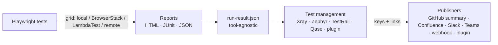

# Integrations — Operating Guide

> Applies to: Playwright Enterprise Kit with the `integrations/` layer | Updated: 2026-10-05
> Version française : [integrations-fr.md](./integrations-fr.md)

The kit works **on its own** (local browsers, HTML/JUnit/JSON reports) and can be **plugged into any tool** through small, interchangeable *providers*. Jira/Xray, Confluence and BrowserStack remain fully supported and behave exactly as before; they are now providers among others.

---

## Table of contents

1. [Concepts](#1-concepts)
2. [5-minute start: no third-party tool at all](#2-5-minute-start-no-third-party-tool-at-all)
3. [How providers are selected](#3-how-providers-are-selected)
4. [Execution grids](#4-execution-grids)
5. [Test management tools](#5-test-management-tools)
6. [Publishers (notifications, dashboards)](#6-publishers-notifications-dashboards)
7. [Publishing a run: `pek-publish` and `run-result.json`](#7-publishing-a-run-pek-publish-and-run-resultjson)
8. [GitHub Actions](#8-github-actions)
9. [Other CI systems (GitLab, Jenkins, Azure DevOps)](#9-other-ci-systems-gitlab-jenkins-azure-devops)
10. [MCP server](#10-mcp-server)
11. [Connecting any other system: write your own provider](#11-connecting-any-other-system-write-your-own-provider)
12. [Backward-compatibility guarantees](#12-backward-compatibility-guarantees)
13. [Troubleshooting](#13-troubleshooting)

---

## 1. Concepts

Three kinds of providers, each answering one question:

| Kind | Question | Built-in providers | Default |
|---|---|---|---|
| **grid** | *Where do the browsers run?* | `local`, `browserstack`, `lambdatest`, `remote` | `local` |
| **test-management** | *Where are the results stored?* | `xray`, `zephyr-scale`, `testrail`, `qase` | none |
| **publisher** | *Who gets notified / which dashboard is updated?* | `github-summary`, `confluence`, `slack`, `teams`, `webhook` | `github-summary` in GitHub Actions |



Key points:

- **Nothing is mandatory.** A provider without credentials is simply inactive.
- **One common format.** Every run produces `run-result.json` (status, counters, environment, tests, links). Each provider reads it; no provider depends on another one.
- **Failures are isolated.** If Slack is down, TestRail still receives its results, and the test job is not failed by a notification problem.
- **Existing scripts are untouched.** BrowserStack, Xray and Confluence providers are thin adapters over the historical `scripts/` and fixtures.

Where things live:

```
integrations/
├── index.js                 # registry: selection, auto-detection, plugins
├── lib/
│   ├── run-result.js        # builds run-result.json (Playwright JSON or JUnit)
│   ├── publish.js           # publication engine
│   └── http.js              # fetch helper (timeouts, readable errors)
├── grids/                   # local, browserstack, lambdatest, remote (+ remote-fixtures.js)
├── test-management/         # xray, zephyr-scale, testrail, qase
├── publishers/              # github-summary, confluence, slack, teams, webhook
├── _template/               # starting point for your own provider
└── __tests__/               # unit tests (npm run test:unit)
pek.config.js                # optional selection file
scripts/pek-publish.js       # CLI: publish the last run
scripts/pek-doctor.js        # CLI: what is configured / active
playwright.config.grid.js    # config for per-test cloud grids (LambdaTest...)
playwright.config.demo.ts    # config targeting the bundled demo app
demo-site/ + scripts/demo-server.js  # tiny demo app (no real application needed)
```

---

## 2. 5-minute start: no third-party tool at all

```bash
npm install
npx playwright install chromium

npm run test:demo        # example tests against the bundled demo app (starts it for you)
npm run pek:doctor       # shows: grid local ACTIVE, every integration off
npm run pek:publish      # writes run-result.json (no remote call)
npm run test:report      # opens the HTML report
```

Against your own application:

```bash
BASE_URL=https://staging.myapp.com npm test
npm run pek:publish -- --scope "Smoke"
```

That is the complete "standalone" mode: no Jira, Confluence, BrowserStack or any account needed.

---

## 3. How providers are selected

For each kind, the first rule that applies wins:

| Priority | Grid | Test management | Publishers |
|---|---|---|---|
| 1. Environment variable | `PEK_GRID` | `PEK_TEST_MANAGEMENT` | `PEK_PUBLISHERS` |
| 2. `pek.config.js` | `grid` | `testManagement` | `publishers` |
| 3. Default | `auto` | `auto` | `auto` |

Values:

- `auto` — every provider whose **required** variables are set. For the grid: `browserstack` > `lambdatest` > `remote` > `local` (first configured wins).
- `none` — disable the kind (for the grid: `local`).
- an explicit list — `xray,testrail` or `slack,teams` (an unknown name fails with the list of valid names).

```js
// pek.config.js (committed, no secret in it)
module.exports = {
  grid: 'auto',
  testManagement: ['testrail'],
  publishers: ['github-summary', 'slack'],
  plugins: ['./integrations/custom/my-tool.js'],
};
```

**Check before running:**

```bash
npm run pek:doctor            # table: ACTIVE / ready / off + missing variable NAMES
node scripts/pek-doctor.js --json
```

> Secrets always come from environment variables (`.env`, CI secrets, MCP client config). `pek.config.js` only selects providers.

---

## 4. Execution grids

Tests import their fixtures from `test-fixtures` (not `@playwright/test`) so the same test runs on any grid:

```ts
import { test, expect } from '../../test-fixtures';
```

### 4.1 `local` (default)

Browsers installed by `npx playwright install`. Every project of `playwright.config.ts` (chromium, firefox, webkit) is used.

```bash
npm test
npm test -- --project=chromium
```

### 4.2 `browserstack` (unchanged)

Auto-selected when `BROWSERSTACK_USERNAME` and `BROWSERSTACK_ACCESS_KEY` are set. Everything works as described in the main README (`browserstack.config.js`, `BS_*` variables, `npm run test:browserstack`, `scripts/resolve-browserstack-config.js`).

### 4.3 `lambdatest`

One LambdaTest session per test through LambdaTest's Playwright CDP endpoint ([docs](https://www.lambdatest.com/support/docs/playwright-testing/)); the pass/fail status is pushed to the LambdaTest dashboard.

| Variable | Required | Example / default |
|---|---|---|
| `LT_USERNAME`, `LT_ACCESS_KEY` | yes | LambdaTest profile → Access key |
| `LT_PLATFORM` | no | `Windows 11` (default), `Windows 10`, `macOS Sonoma` |
| `LT_BROWSER` | no | `Chrome` (default), `MicrosoftEdge`, `pw-chromium`, `pw-firefox`, `pw-webkit` |
| `LT_BROWSER_VERSION` | no | `latest` |
| `LT_BUILD_NAME`, `LT_PROJECT_NAME` | no | shown in the dashboard |
| `PEK_GRID_WORKERS` | no | `2` parallel sessions |

```bash
export LT_USERNAME=... LT_ACCESS_KEY=...
npm run test:grid                      # = playwright test --config=playwright.config.grid.js
```

If BrowserStack credentials are also present, force it with `PEK_GRID=lambdatest`.

### 4.4 `remote` — any Playwright server

For any endpoint compatible with `browserType.connect()`: a self-hosted `npx playwright run-server`, the official `mcr.microsoft.com/playwright` Docker image, Browserless, Moon, a Kubernetes grid… It uses Playwright's native [`connectOptions`](https://playwright.dev/docs/api/class-testoptions#test-options-connect-options), so all projects keep working.

```bash
# Example: a Playwright server in Docker (use the same version as the kit's @playwright/test)
docker run --rm -p 3000:3000 mcr.microsoft.com/playwright:v1.63.0-noble \
  npx -y playwright@1.63.0 run-server --port 3000 --host 0.0.0.0

PEK_WS_ENDPOINT=ws://localhost:3000/ BASE_URL=https://staging.myapp.com npm test
```

`PEK_WS_HEADERS='{"Authorization":"Bearer xxx"}'` adds connection headers if your grid requires them.

> Sauce Labs runs Playwright through its own `saucectl` runner rather than a connect endpoint, so it is not a grid provider; results produced there can still be published with `pek-publish`.

---

## 5. Test management tools

All of them are fed by `npm run pek:publish` (or the MCP tool `pek_publish_results`). They read the same reports produced by any grid.

### 5.1 `xray` — Xray Cloud (Jira)

| Variable | Required | Notes |
|---|---|---|
| `XRAY_CLIENT_ID`, `XRAY_CLIENT_SECRET`, `JIRA_PROJECT_KEY` | yes | as before |
| `XRAY_TEST_PLAN_KEY` or `--test-plan` | no | link the Test Execution to a Test Plan |
| `JIRA_URL`, `JIRA_USER`, `JIRA_API_TOKEN` | no | enables the enrichment: title, labels, custom fields, remote links (CI, grid), HTML report attachment |
| `JIRA_CUSTOM_FIELD_*`, `XRAY_ENDPOINT` | no | as before |

```bash
npm run pek:publish -- --test-plan MYPROJECT-100 --scope "Regression"
```

It runs the same steps as the CI scripts: `add-timestamps-to-xray-report.js` → `remove-test-keys.js` → JUnit import → Jira enrichment (Node equivalent of `jira-post-execution.ps1`, no PowerShell needed). The GitHub Actions workflow keeps using the original PowerShell scripts.

Linking tests: `test_key` annotation, as documented in the README.

### 5.2 `zephyr-scale` — Zephyr Scale Cloud

Uploads the JUnit report and creates a Test Cycle ([docs](https://support.smartbear.com/zephyr-scale-cloud/docs/en/test-automation/upload-test-results.html)).

| Variable | Required | Notes |
|---|---|---|
| `ZEPHYR_API_TOKEN` | yes | Jira → Zephyr Scale → API access tokens |
| `ZEPHYR_PROJECT_KEY` | yes | Jira project key |
| `ZEPHYR_BASE_URL` | no | EU instances: `https://eu.api.zephyrscale.smartbear.com/v2` |
| `ZEPHYR_AUTO_CREATE_TEST_CASES` | no | `true` (default): unknown tests become test cases |

Linking tests: put the test case key in the test title, e.g. `test('MYPROJECT-T12 user can login', …)`.

### 5.3 `testrail` — TestRail

Creates a run with the linked cases, then posts one result per case ([API](https://support.testrail.com/hc/en-us/articles/7077083596436-Introduction-to-the-TestRail-API)).

| Variable | Required | Notes |
|---|---|---|
| `TESTRAIL_URL` | yes | `https://yourcompany.testrail.io` |
| `TESTRAIL_USER`, `TESTRAIL_API_KEY` | yes | My Settings → API Keys (enable the API in Administration → Site Settings) |
| `TESTRAIL_PROJECT_ID` | yes | number in the project URL |
| `TESTRAIL_SUITE_ID` | multi-suite projects | |
| `TESTRAIL_RUN_ID` | no | add results to an existing run instead of creating one |
| `TESTRAIL_CLOSE_RUN` | no | `true` to close the run afterwards |

Linking tests — either form:

```ts
test('C1234 user can login', async ({ page }) => { /* ... */ });

test('user can logout', async ({ page }) => {
  test.info().annotations.push({ type: 'testrail_case', description: 'C1235' }); // several: 'C1, C2'
});
```

Status mapping: passed/flaky → *Passed*, failed → *Failed*, skipped → left *Untested*. Tests without a case ID are ignored.

### 5.4 `qase` — Qase

Creates a run, posts results in bulk, completes the run ([API](https://developers.qase.io/reference/create-run)).

| Variable | Required | Notes |
|---|---|---|
| `QASE_API_TOKEN` | yes | Qase → Apps → API tokens |
| `QASE_PROJECT_CODE` | yes | e.g. `DEMO` |
| `QASE_RUN_ID` | no | reuse an existing run (it is then not completed) |
| `QASE_COMPLETE_RUN` | no | `false` to keep the created run open |
| `QASE_BASE_URL`, `QASE_APP_URL` | no | self-hosted / regional instances |

Linking tests: `test.info().annotations.push({ type: 'qase_id', description: '42' })` or the official reporter's title convention `"user can login (Qase ID: 42)"`.

---

## 6. Publishers (notifications, dashboards)

Publishers run **after** test-management providers, so their messages contain the created keys and links (Xray execution, TestRail run, BrowserStack build, CI run…).

### 6.1 `github-summary`

Auto-enabled inside GitHub Actions: Markdown table (counters, environment, links, collapsible list of failures) in the job's *Summary* tab.

### 6.2 `confluence` (unchanged)

Wraps `scripts/update-confluence-report.js`. Same variables as before (`CONFLUENCE_URL` ending in `/wiki`, `CONFLUENCE_USER`, `CONFLUENCE_API_TOKEN`, `CONFLUENCE_SPACE_KEY`, …). When Xray ran in the same publication, its key is forwarded to the dashboard row; the grid link fills the *BrowserStack* column.

### 6.3 `slack`

1. Create a Slack app → *Incoming Webhooks* → *Add New Webhook to Workspace* → pick the channel ([docs](https://docs.slack.dev/messaging/sending-messages-using-incoming-webhooks)).
2. `SLACK_WEBHOOK_URL=https://hooks.slack.com/services/...`
3. Optional `SLACK_NOTIFY_ON=failure` to stay quiet on green runs.

### 6.4 `teams`

1. In the Teams channel: *Workflows* → template **"Post to a channel when a webhook request is received"** → copy the HTTP URL ([docs](https://learn.microsoft.com/en-us/microsoftteams/platform/webhooks-and-connectors/how-to/add-incoming-webhook)).
2. `TEAMS_WEBHOOK_URL=<that URL>` — an Adaptive Card is posted (status, counters, failures, buttons to the links).
3. Optional `TEAMS_NOTIFY_ON=failure`.

### 6.5 `webhook` — the universal adapter

POSTs the whole `run-result.json` to any URL: n8n, Zapier, Make, Power Automate, an internal dashboard, a serverless function…

| Variable | Notes |
|---|---|
| `PEK_WEBHOOK_URL` | target (required) |
| `PEK_WEBHOOK_TOKEN` | sent as `Authorization: Bearer <token>` |
| `PEK_WEBHOOK_SECRET` | `X-PEK-Signature: sha256=<HMAC-SHA256 of the raw body>` |

Verifying the signature on the receiving side (Node):

```js
const crypto = require('crypto');
const expected = 'sha256=' + crypto.createHmac('sha256', process.env.PEK_WEBHOOK_SECRET).update(rawBody).digest('hex');
const valid = crypto.timingSafeEqual(Buffer.from(expected), Buffer.from(req.headers['x-pek-signature'] || ''));
```

---

## 7. Publishing a run: `pek-publish` and `run-result.json`

```bash
node scripts/pek-publish.js [options]      # or: npm run pek:publish -- [options]
```

| Option | Effect |
|---|---|
| `--scope "<label>"` | scope label (default `All Tests` or `PEK_TEST_SCOPE`) |
| `--test-plan KEY` | Xray Test Plan |
| `--only a,b` / `--exclude a,b` | restrict / skip providers by name (any kind) |
| `--link "Label=url"` | extra link (repeatable); prefix `grid:` for the grid build link, e.g. `--link "grid:BrowserStack=https://…"` |
| `--report file` / `--junit file` | inputs (default `test-results.json` / `xray-report.xml`) |
| `--out file` | output (default `run-result.json`) |
| `--dry-run` | build `run-result.json` and list what *would* be published, no remote call |
| `--strict` | exit code 1 if a provider fails (default: failures are reported, exit 0) |
| `--json` | machine-readable summary on the last stdout line |

Inputs: the Playwright JSON report (`test-results.json`, produced by every kit config) is preferred; the JUnit report is used as a fallback, so older custom configs keep working.

`run-result.json` (schema version 1, excerpt):

```json
{
  "schemaVersion": 1,
  "status": "FAIL",
  "scope": "Regression",
  "stats": { "total": 42, "passed": 40, "failed": 1, "flaky": 1, "skipped": 0, "durationMs": 183000 },
  "environment": { "grid": "browserstack", "os": "Windows", "osVersion": "11", "browser": "chrome", "browserVersion": "latest", "deviceName": "windows-11-chrome-latest", "projects": [] },
  "ci": { "provider": "github-actions", "runUrl": "https://github.com/org/repo/actions/runs/123", "runNumber": "57", "branch": "main" },
  "tests": [{ "titlePath": ["Login", "user can login"], "file": "auth/login.spec.ts", "status": "failed", "durationMs": 5200, "error": "…", "annotations": [{ "type": "testrail_case", "description": "C1234" }] }],
  "links": [{ "kind": "ci", "label": "CI run #57", "url": "…" }, { "kind": "test-management", "label": "Xray PROJ-142", "url": "…" }],
  "testManagement": { "xray": { "key": "PROJ-142", "url": "…" } }
}
```

`status` is `PASS`, `FAIL` (at least one failed test) or `UNKNOWN` (no report found).

---

## 8. GitHub Actions

### 8.1 Manual run (`workflow_dispatch`)

| Input | Change |
|---|---|
| `issueKey` | now **optional**: Xray upload only when it is filled *and* the Xray secrets exist |
| `grid` | **new**: `auto` (BrowserStack > LambdaTest > local depending on the secrets), `browserstack`, `lambdatest`, `local` |
| `os`, `osVersion`, `browser`, `browserVersion` | used by BrowserStack (as before) and translated for LambdaTest |
| `testScope`, `confluenceReport` | unchanged; Confluence is skipped with a warning if its secrets are missing |

Without any secret, a manual run executes locally — against the demo app when the `BASE_URL` variable is not set — and publishes the GitHub summary: the template is green out of the box.

Pipeline order: resolve integrations → (BrowserStack/LambdaTest config) → tests → BrowserStack link → Xray upload → Jira enrichment → Confluence → **other integrations** (`pek-publish --exclude xray,confluence`) → artifacts (`run-result.json` included) → fail the job if tests failed.

### 8.2 Push / pull request

Local chromium run (only if the `BASE_URL` variable exists, as before) + GitHub summary. Set the variable `PEK_PUBLISH_ON_PUSH=true` to also feed TestRail/Slack/… on these runs.

### 8.3 Where to put what

Settings → Secrets and variables → Actions:

| Secrets (credentials, URLs) | Variables (non-secret) |
|---|---|
| `BROWSERSTACK_USERNAME`, `BROWSERSTACK_ACCESS_KEY` | `BASE_URL` |
| `LT_USERNAME`, `LT_ACCESS_KEY` | `PEK_TEST_MANAGEMENT`, `PEK_PUBLISHERS`, `PEK_PUBLISH_ON_PUSH` |
| `JIRA_*`, `XRAY_*`, `CONFLUENCE_*` (as before) | `TESTRAIL_PROJECT_ID`, `TESTRAIL_SUITE_ID` |
| `TESTRAIL_URL`, `TESTRAIL_USER`, `TESTRAIL_API_KEY` | `QASE_PROJECT_CODE` |
| `QASE_API_TOKEN` | `ZEPHYR_PROJECT_KEY`, `ZEPHYR_BASE_URL` |
| `ZEPHYR_API_TOKEN` | `SLACK_NOTIFY_ON`, `TEAMS_NOTIFY_ON` |
| `SLACK_WEBHOOK_URL`, `TEAMS_WEBHOOK_URL` | |
| `PEK_WEBHOOK_URL`, `PEK_WEBHOOK_TOKEN`, `PEK_WEBHOOK_SECRET` | |

Each secret is passed only to the steps that use it, never at job level.

### 8.4 PR checks (`ci-check.yml`)

- **Lint & Type Check** now also runs `npm run test:unit` (registry, run-result, every provider with mocked HTTP).
- **Standalone smoke (no integrations)** runs the example tests against the demo app and asserts `run-result.json` is `PASS` — a permanent proof that the kit works without any third party.

---

## 9. Other CI systems (GitLab, Jenkins, Azure DevOps)

`run-result.json` detects GitLab CI, Jenkins and Azure DevOps (run URL, number, branch, commit) in addition to GitHub Actions. Example `.gitlab-ci.yml`:

```yaml
e2e:
  image: mcr.microsoft.com/playwright:v1.63.0-noble
  script:
    - npm ci
    - npx playwright test --project=chromium || true
    - node scripts/pek-publish.js --scope "GitLab nightly" --strict
    - node -e "process.exit(require('./run-result.json').status === 'PASS' ? 0 : 1)"
  artifacts:
    when: always
    paths: [playwright-report/, run-result.json, xray-report.xml]
```

Credentials are provided as CI/CD variables with the same names as in `.env.example`.

---

## 10. MCP server

Two generic tools join the six existing ones (which are unchanged):

| Tool | Purpose |
|---|---|
| `pek_list_integrations` | what is configured / active (read-only, variable names only) |
| `pek_publish_results` | publish the last run to the active providers (`only`, `exclude`, `links`, `testPlanKey`, `dryRun`) |

Example prompts:

> *"Which integrations are active?"*
> *"Run the example tests on LambdaTest, then publish the results to TestRail and Slack only."*
> *"Dry-run the publication of the last run."*

`pek_run_tests` also accepts `extraEnv.PEK_GRID` and the non-secret `LT_*` variables. Credentials can never be passed by the model: they belong in the MCP client `env` block. Details: [mcp-server-user-guide.md](./mcp-server-user-guide.md).

---

## 11. Connecting any other system: write your own provider

A provider is a plain CommonJS module. Start from [`integrations/_template/custom-publisher.js`](../integrations/_template/custom-publisher.js):

```bash
mkdir -p integrations/custom
cp integrations/_template/custom-publisher.js integrations/custom/my-tool.js
```

```js
// integrations/custom/my-tool.js
const { request } = require('../lib/http');
const { headline } = require('../lib/run-result');

module.exports = {
  kind: 'publisher',                 // or 'test-management'
  name: 'my-tool',                   // kebab-case, used in PEK_PUBLISHERS / --only
  label: 'My Tool',
  env: { required: ['MY_TOOL_URL', 'MY_TOOL_TOKEN'], optional: [] },
  async publish(run, ctx) {
    await request(ctx.env.MY_TOOL_URL, {
      method: 'POST',
      headers: { Authorization: `Bearer ${ctx.env.MY_TOOL_TOKEN}` },
      json: { text: headline(run), status: run.status },
      fetch: ctx.fetch,
    });
    return { message: 'sent' };      // test-management: return { key, url, links }
  },
};
```

Declare it, check it, use it:

```js
// pek.config.js
plugins: ['./integrations/custom/my-tool.js'],
```

```bash
npm run pek:doctor                         # my-tool appears (ready / off + missing variables)
npm run pek:publish -- --only my-tool --dry-run
```

### Contract

| Field | Kinds | Description |
|---|---|---|
| `kind`, `name` | all | required; `name` is kebab-case and unique per kind (a plugin may override a built-in of the same name) |
| `label`, `description`, `docs` | all | shown by `pek:doctor` / `pek_list_integrations` |
| `env.required` / `env.optional` | all | auto-activation when every required variable is set; names listed by the doctor |
| `isConfigured(env)` | all | optional custom activation rule |
| `auto: false` | lists | never auto-activated, only when named explicitly |
| `publish(run, ctx)` | test-management, publisher | returns `{ key?, url?, links?, message?, skipped? }` |
| `createFixtures()` | grid | returns `{ test, expect }` |
| `connectOptions(env)` | grid | for grids reachable through Playwright's native `connectOptions` |
| `wsEndpoint({ env, testName, buildName })`, `browserType(env)`, `markStatus(page, {status, reason})`, `buildName(env)` | grid | for per-test cloud sessions: `createFixtures() { return require('../grids/remote-fixtures').createRemoteFixtures(module.exports) }` |
| `describeTarget(env)` | grid | `{ os, osVersion, browser, browserVersion, deviceName }` for reports |

`ctx` gives: `env`, `log(msg)`, `fetch` (mockable in tests), `rootDir`, `options.testPlanKey`, `runNodeScript(script, args, extraEnv)` to reuse a kit script.

Rules of thumb: never log secrets (`lib/http.js` already redacts URLs in errors), return `{ skipped: true, message }` when there is nothing to send, and throw on real failures — the engine isolates them. Unit-test your provider with a mocked `fetch`, like [`integrations/__tests__/providers.test.js`](../integrations/__tests__/providers.test.js).

---

## 12. Backward-compatibility guarantees

| Before | Now |
|---|---|
| BrowserStack credentials present → tests run on BrowserStack, otherwise locally | identical (`grid: auto`) |
| `npm test`, `npm run test:browserstack`, other npm scripts | identical |
| `browserstack-fixtures.js`, `browserstack.config.js`, `playwright.config.browserstack.js` | unchanged files |
| `upload-xray.ps1`, `jira-post-execution.ps1`, `update-confluence-report.js`, BrowserStack scripts | unchanged and still used by the workflow |
| `xray-report.xml`, HTML report | still produced; `test-results.json` added |
| Manual workflow with `issueKey` + Xray/BrowserStack secrets | same steps, same order, same outputs |
| The 6 `pek_*` MCP tools | unchanged; 2 tools added |
| Evidence attached only for `DEMO-*` keys (bug) | fixed: any Jira key |

What changed on purpose: `issueKey` is optional, missing Xray/Confluence secrets now produce a warning instead of a red job, and a manual run without BrowserStack secrets runs locally instead of failing.

---

## 13. Troubleshooting

| Symptom | Fix |
|---|---|
| `Unknown grid 'xxx' (set by PEK_GRID)` | typo; valid names are listed in the message / `npm run pek:doctor` |
| Integration shown `off` | `pek:doctor` lists the missing variable **names** |
| Integration `skipped – No test linked to a TestRail case` | add `C123` in the title or a `testrail_case` annotation (Qase: `qase_id`) |
| `status UNKNOWN`, `0 test(s) from none` | no report: run the tests first, or pass `--report` / `--junit` |
| `HTTP 401/403` in a provider | wrong token / insufficient permissions for that tool; other providers still ran |
| LambdaTest tests run 3 times | use `npm run test:grid` (single project), not `npm test` |
| `remote` grid: version mismatch error | the Playwright server must run the same version as the kit's `@playwright/test` |
| Want a failing CI step when a notification fails | add `--strict` to `pek-publish` |

---

*See also: [README](../README.md) · [MCP Server User Guide](./mcp-server-user-guide.md) · [Version française](./integrations-fr.md)*
