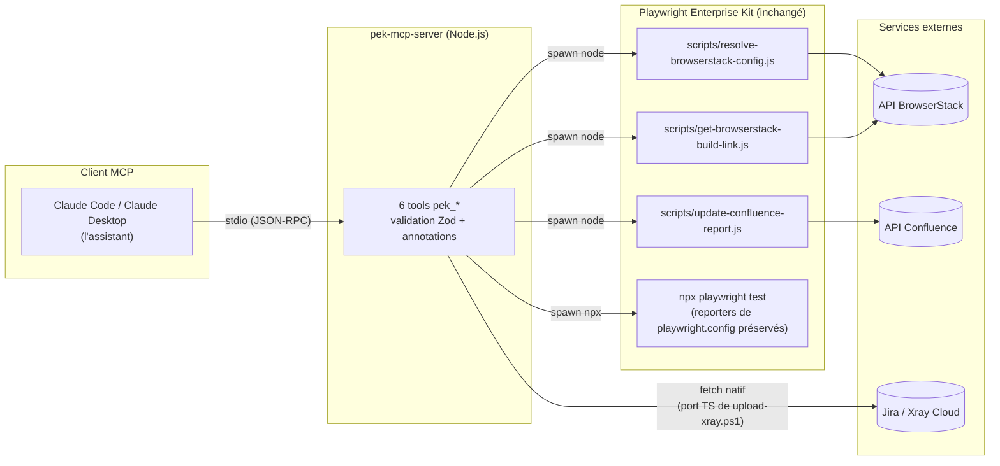
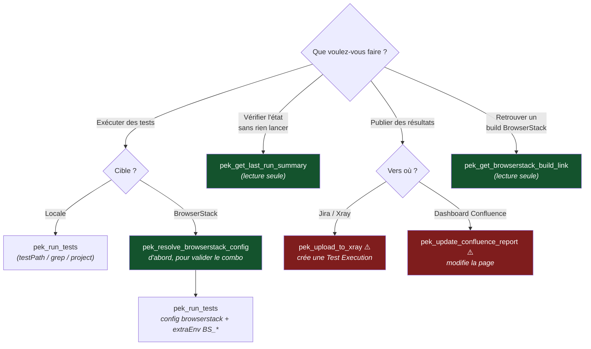
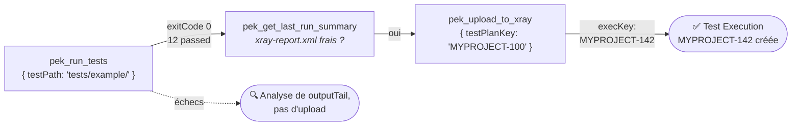
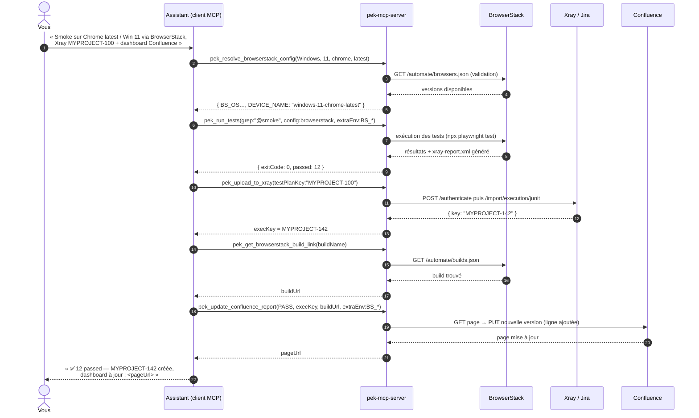
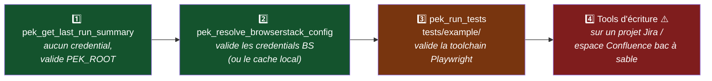

# PEK MCP Server — Guide utilisateur (FR)

> Version : 0.1.0 | Mis à jour : 2026-07-08
> S'applique à : `mcp-server/` dans le dépôt Playwright Enterprise Kit
> Version anglaise : [mcp-server-user-guide.md](./mcp-server-user-guide.md)

Ce guide explique pas à pas comment installer, configurer et utiliser le **PEK MCP Server** — le serveur Model Context Protocol qui transforme les workflows CI/CD du Playwright Enterprise Kit (runs Playwright, BrowserStack, Jira/Xray, Confluence) en outils pilotables en langage naturel par un assistant IA.

---

## Sommaire

1. [À quoi ça sert](#1-à-quoi-ça-sert)
2. [Comment ça marche (architecture)](#2-comment-ça-marche-architecture)
3. [Prérequis](#3-prérequis)
4. [Installation](#4-installation)
5. [Configuration du client MCP](#5-configuration-du-client-mcp)
6. [Référence des variables d'environnement](#6-référence-des-variables-denvironnement)
7. [Quel tool pour quel besoin ?](#7-quel-tool-pour-quel-besoin-)
8. [Référence détaillée des tools](#8-référence-détaillée-des-tools)
9. [Workflows de bout en bout](#9-workflows-de-bout-en-bout)
10. [Tester avec MCP Inspector](#10-tester-avec-mcp-inspector)
11. [Dépannage](#11-dépannage)
12. [Modèle de sécurité](#12-modèle-de-sécurité)
13. [Limites connues & roadmap](#13-limites-connues--roadmap)

---

## 1. À quoi ça sert

Une fois le serveur connecté, vous pouvez dire à votre client MCP (Claude Code, Claude Desktop, ou tout client compatible) :

> *« Lance les tests smoke sur Chrome latest / Windows 11 via BrowserStack, remonte les résultats dans Xray sous le Test Plan MYPROJECT-100, et mets à jour le dashboard Confluence. »*

…et l'assistant enchaîne les bons outils, en s'appuyant sur vos scripts existants du kit. Plus de terminal, plus de copier-coller de variables `BS_*`, plus d'upload Xray manuel.

Le serveur expose **6 tools**, tous préfixés `pek_` :

| Tool | Rôle | Effets de bord |
|---|---|---|
| `pek_run_tests` | Exécuter la suite Playwright | Local uniquement (artefacts de test) |
| `pek_get_last_run_summary` | Inspecter les artefacts du dernier run | Aucun (lecture seule) |
| `pek_resolve_browserstack_config` | Valider un combo OS/navigateur via l'API BrowserStack | Aucun (lecture seule) |
| `pek_get_browserstack_build_link` | Retrouver l'URL du dashboard Automate d'un build | Aucun (lecture seule) |
| `pek_upload_to_xray` | Envoyer les résultats JUnit vers Xray Cloud | **Crée une Test Execution Jira** |
| `pek_update_confluence_report` | Ajouter une ligne au dashboard Confluence | **Modifie une page Confluence** |

---

## 2. Comment ça marche (architecture)

Le serveur est une **façade** légère et typée au-dessus du kit — le kit lui-même reste inchangé.



Deux règles de conception :

1. **Les scripts Node existants restent la source de vérité.** Les tools BrowserStack et Confluence *wrappent* `scripts/*.js` via des processus enfants ; tout correctif apporté à ces scripts est automatiquement répercuté côté serveur MCP.
2. **La seule réimplémentation est l'upload Xray** (`src/services/xray.ts`), port TypeScript de `scripts/upload-xray.ps1`, pour que le serveur tourne à l'identique sous Windows, macOS et Linux sans dépendance PowerShell. Même flux API : `POST /api/v2/authenticate` → `POST /api/v2/import/execution/junit`, y compris le nettoyage préalable des propriétés `test_key` orphelines via `scripts/remove-test-keys.js`.

Arborescence des sources :

```
mcp-server/
├── package.json            # arbre de dépendances propre (SDK + zod), indépendant du kit
├── tsconfig.json           # mode strict, modules Node16
├── README.md               # version courte de ce guide
└── src/
    ├── index.ts            # point d'entrée : McpServer + transport stdio
    ├── constants.ts        # résolution de PEK_ROOT, limites de sortie, défauts
    ├── services/
    │   ├── exec.ts         # helper spawn (timeouts, capture de sortie, parsing JSON)
    │   └── xray.ts         # client Xray Cloud (auth + import JUnit)
    └── tools/
        ├── tests.ts        # pek_run_tests, pek_get_last_run_summary
        ├── browserstack.ts # pek_resolve_browserstack_config, pek_get_browserstack_build_link
        ├── xray.ts         # pek_upload_to_xray
        └── confluence.ts   # pek_update_confluence_report
```

---

## 3. Prérequis

| Prérequis | Minimum | Remarques |
|---|---|---|
| Node.js | 18+ | `fetch` natif et `AbortSignal.timeout` sont utilisés ; LTS 20/22 recommandée |
| Playwright Enterprise Kit | ce dépôt, `npm install` fait à la racine | Le serveur lance `npx playwright test` depuis la racine du kit |
| Un client MCP | Claude Code, Claude Desktop ou MCP Inspector | Tout client MCP stdio fonctionne |
| Compte BrowserStack | — | Uniquement pour les deux tools BrowserStack et les runs BrowserStack |
| Paire de clés API Xray Cloud | client_id / client_secret | Uniquement pour `pek_upload_to_xray` — à créer dans Xray > API Keys |
| Token API Atlassian | — | Uniquement pour `pek_update_confluence_report` |

> Le serveur en lui-même n'exige **aucun credential obligatoire**. Chaque tool indique précisément quelle variable manque si vous l'appelez sans configuration.

---

## 4. Installation

Depuis la racine du dépôt :

```bash
cd mcp-server
npm install
npm run build
```

Résultat attendu : un dossier `dist/` avec `dist/index.js` comme point d'entrée exécutable.

Vérification rapide (le serveur logue sa ligne de démarrage sur **stderr**, stdout étant réservé au protocole MCP) :

```bash
node dist/index.js
# stderr → pek-mcp-server started (kit root: /chemin/vers/playwright-enterprise-kit)
# Ctrl+C pour arrêter
```

### Mode développement

```bash
npm run dev      # tsc --watch, recompile à la sauvegarde
```

---

## 5. Configuration du client MCP

### 5.1 Claude Code (recommandé pour ce dépôt)

Créez (ou complétez) un **`.mcp.json` à la racine du dépôt**. Claude Code le détecte automatiquement à l'ouverture du repo, et les chemins relatifs se résolvent depuis cette racine :

```json
{
  "mcpServers": {
    "playwright-kit": {
      "command": "node",
      "args": ["mcp-server/dist/index.js"],
      "env": {
        "BROWSERSTACK_USERNAME": "votre_username_bs",
        "BROWSERSTACK_ACCESS_KEY": "votre_access_key_bs",
        "XRAY_CLIENT_ID": "votre_client_id_xray",
        "XRAY_CLIENT_SECRET": "votre_client_secret_xray",
        "JIRA_PROJECT_KEY": "MYPROJECT",
        "JIRA_URL": "https://yourco.atlassian.net",
        "CONFLUENCE_URL": "https://yourco.atlassian.net/wiki",
        "CONFLUENCE_USER": "vous@yourco.com",
        "CONFLUENCE_API_TOKEN": "votre_token_atlassian",
        "CONFLUENCE_SPACE_KEY": "QA"
      }
    }
  }
}
```

Ou bien, depuis un terminal dans le dépôt :

```bash
claude mcp add playwright-kit -- node mcp-server/dist/index.js
```

puis ajoutez les variables d'environnement dans la config générée, ou appuyez-vous sur des variables déjà exportées dans votre shell (le serveur hérite de l'environnement parent).

> **Astuce — garder les secrets hors de `.mcp.json` :** si le fichier est commité, laissez `env` vide et exportez les secrets dans votre profil shell. Un `.mcp.json` contenant de vrais credentials doit impérativement être ajouté au `.gitignore`.

Vérifiez la connexion dans Claude Code :

```
/mcp
```

Vous devez voir `playwright-kit` listé avec 6 tools.

### 5.2 Claude Desktop

Éditez `claude_desktop_config.json` :

- **Windows :** `%APPDATA%\Claude\claude_desktop_config.json`
- **macOS :** `~/Library/Application Support/Claude/claude_desktop_config.json`

Claude Desktop lance le serveur depuis un répertoire de travail arbitraire : utilisez donc un **chemin absolu** et définissez **`PEK_ROOT`** explicitement :

```json
{
  "mcpServers": {
    "playwright-kit": {
      "command": "node",
      "args": ["E:\\Code\\playwright-enterprise-kit\\mcp-server\\dist\\index.js"],
      "env": {
        "PEK_ROOT": "E:\\Code\\playwright-enterprise-kit",
        "BROWSERSTACK_USERNAME": "votre_username_bs",
        "BROWSERSTACK_ACCESS_KEY": "votre_access_key_bs",
        "XRAY_CLIENT_ID": "votre_client_id_xray",
        "XRAY_CLIENT_SECRET": "votre_client_secret_xray",
        "JIRA_PROJECT_KEY": "MYPROJECT",
        "CONFLUENCE_URL": "https://yourco.atlassian.net/wiki",
        "CONFLUENCE_USER": "vous@yourco.com",
        "CONFLUENCE_API_TOKEN": "votre_token_atlassian",
        "CONFLUENCE_SPACE_KEY": "QA"
      }
    }
  }
}
```

Redémarrez Claude Desktop après modification. Les tools apparaissent sous l'icône 🔌.

> En JSON sous Windows, les antislashs doivent être doublés (`E:\\Code\\...`), ou utilisez des slashs (`E:/Code/...`) — Node accepte les deux.

### 5.3 Tout autre client MCP

Le serveur parle le MCP standard sur **stdio**. Pointez votre client vers :

```
command : node
args    : [<chemin absolu>/mcp-server/dist/index.js]
env     : PEK_ROOT=<chemin absolu de la racine du kit> + credentials selon besoin
```

---

## 6. Référence des variables d'environnement

| Variable | Consommée par | Requise ? | Défaut | Remarques |
|---|---|---|---|---|
| `PEK_ROOT` | tous les tools | Non | répertoire parent de `mcp-server/` | **À définir dès que le répertoire de travail du client n'est pas le repo** (Claude Desktop, installations globales) |
| `BROWSERSTACK_USERNAME` | tools BrowserStack, runs BrowserStack | Pour les fonctions BrowserStack | — | Sans elle, `pek_resolve_browserstack_config` bascule sur le cache local de versions |
| `BROWSERSTACK_ACCESS_KEY` | idem | idem | — | |
| `XRAY_CLIENT_ID` | `pek_upload_to_xray` | Oui pour Xray | — | Paire de clés API Xray Cloud |
| `XRAY_CLIENT_SECRET` | `pek_upload_to_xray` | Oui pour Xray | — | |
| `XRAY_ENDPOINT` | `pek_upload_to_xray` | Non | `xray.cloud.getxray.app` | À changer uniquement pour les endpoints régionaux |
| `JIRA_PROJECT_KEY` | `pek_upload_to_xray` | Si l'argument `projectKey` est omis | — | ex. `MYPROJECT` |
| `JIRA_URL` | `pek_update_confluence_report` | Non | dérivée de `CONFLUENCE_URL` | Sert aux liens vers les Test Executions dans le dashboard |
| `CONFLUENCE_URL` | `pek_update_confluence_report` | Oui pour Confluence | — | **Doit se terminer par `/wiki` sur Atlassian Cloud** |
| `CONFLUENCE_USER` | idem | Oui pour Confluence | — | Email du compte |
| `CONFLUENCE_API_TOKEN` | idem | Oui pour Confluence | — | Token API Atlassian |
| `CONFLUENCE_SPACE_KEY` | idem | Oui pour Confluence | — | ex. `QA` |
| `CONFLUENCE_PAGE_TITLE` | idem | Non | `Test Execution Dashboard` | |
| `CONFLUENCE_PARENT_PAGE_ID` | idem | Non | — | Page parente pour le dashboard auto-créé |

---

## 7. Quel tool pour quel besoin ?

Arbre de décision rapide — utile aussi pour comprendre comment l'assistant choisit :



En vert : tools sans effet de bord, appelables à tout moment. En rouge : tools qui écrivent dans Jira ou Confluence à chaque appel.

---

## 8. Référence détaillée des tools

Conventions utilisées ci-dessous :

- Les **exemples de prompts** sont des phrases que vous pouvez taper telles quelles à l'assistant ; il les mappe vers le tool.
- **Retour** décrit le payload `structuredContent` que chaque tool émet en plus du texte lisible.
- Les tools en lecture seule sont sûrs à tout moment ; ceux à effets de bord sont signalés.

---

### 8.1 `pek_run_tests`

Exécute `npx playwright test` depuis la racine du kit et renvoie le résultat. Les reporters déclarés dans `playwright.config` ne sont **pas écrasés** : `xray-report.xml` (JUnit pour Xray) et le rapport HTML continuent d'être générés exactement comme en CI.

**Paramètres**

| Nom | Type | Défaut | Description |
|---|---|---|---|
| `grep` | string | — | N'exécute que les tests dont le titre matche (mappe `--grep`), ex. `"@smoke"` |
| `testPath` | string | — | Fichier ou répertoire relatif à la racine, ex. `"tests/example/"` |
| `project` | string | — | Nom de projet Playwright (mappe `--project`) |
| `config` | string | — | Config alternative, ex. `"playwright.config.browserstack.js"` |
| `headed` | boolean | `false` | Navigateur visible |
| `extraEnv` | object | — | Variables d'env supplémentaires — typiquement le bloc `BS_*` issu de `pek_resolve_browserstack_config` |
| `timeoutSeconds` | number | `900` | Arrêt forcé après ce délai (30–7200) |

**Retour**

```json
{
  "exitCode": 0,
  "passed": 12, "failed": 0, "flaky": 0, "skipped": 1,
  "durationMs": 48211,
  "timedOut": false,
  "outputTail": "…6000 derniers caractères de la sortie…"
}
```

**Exemples de prompts**

- *« Lance les tests d'exemple »* → `{ testPath: "tests/example/" }`
- *« Exécute tout ce qui est taggé @smoke, en headed »* → `{ grep: "@smoke", headed: true }`
- *« Lance la config BrowserStack avec ces variables BS_ »* → `{ config: "playwright.config.browserstack.js", extraEnv: { …BS_* } }`

**Bon à savoir**

- Un exit code non nul est rapporté dans le résumé, pas levé en exception — l'assistant peut lire les échecs et décider de la suite (relancer un sous-ensemble, inspecter `outputTail`, …).
- Pour les longues campagnes BrowserStack, augmentez explicitement `timeoutSeconds` (ex. 3600).

---

### 8.2 `pek_get_last_run_summary` *(lecture seule)*

Vérifie la présence, l'horodatage et la taille des artefacts du dernier run, sans rien exécuter :

- `xray-report.xml` — JUnit produit par `@xray-app/playwright-junit-reporter`
- `playwright-report/` — rapport HTML
- `test-results/` — traces, captures, vidéos

**Paramètres :** aucun.

**Retour**

```json
{
  "artefacts": [
    { "name": "xray-report.xml", "path": "…", "exists": true,
      "modifiedAt": "2026-07-08T09:14:02.000Z", "sizeBytes": 18734 },
    …
  ]
}
```

**Exemples de prompts**

- *« Y a-t-il un rapport Xray frais à uploader ? »*
- *« Quand s'est terminé le dernier run ? »* (via `modifiedAt`)

**Usage typique :** appelé par l'assistant juste avant `pek_upload_to_xray` pour confirmer que le fichier JUnit existe et est récent — et éviter d'uploader des résultats périmés.

---

### 8.3 `pek_resolve_browserstack_config` *(lecture seule)*

Valide un combo OS/navigateur contre l'**API BrowserStack en direct** (avec le cache local de versions du kit en secours si l'API est injoignable ou les credentials absents) et renvoie le bloc d'environnement résolu. Wrappe `scripts/resolve-browserstack-config.js`.

**Paramètres**

| Nom | Type | Description |
|---|---|---|
| `os` | `"Windows"` \| `"Mac"` | OS cible |
| `osVersion` | string | `"11"`, `"10"` … / `"Sonoma"`, `"Sequoia"` … |
| `browser` | `"chrome"` \| `"chromium"` \| `"firefox"` \| `"safari"` \| `"edge"` | Navigateur cible |
| `browserVersion` | string | `"latest"`, `"latest-1"`, `"131"` … (les motifs `latest*` court-circuitent la validation API) |

**Retour**

```json
{
  "BS_OS": "Windows",
  "BS_OS_VERSION": "11",
  "BS_BROWSER": "playwright-chromium",
  "BS_BROWSER_VERSION": "latest",
  "DEVICE_NAME": "windows-11-chrome-latest"
}
```

**Exemples de prompts**

- *« Safari 18 est-il disponible sur Sonoma ? »*
- *« Prépare une config Chrome latest sur Windows 11 »*

**Chaînage :** injectez l'objet retourné tel quel dans `pek_run_tests.extraEnv` avec `config: "playwright.config.browserstack.js"`. Le `DEVICE_NAME` alimente aussi la ligne du dashboard Confluence plus tard.

**En cas d'échec de validation**, le tool renvoie l'erreur détaillée du script (liste des versions disponibles), ce qui permet à l'assistant de proposer lui-même une alternative valide.

---

### 8.4 `pek_get_browserstack_build_link` *(lecture seule)*

Retrouve l'URL du dashboard BrowserStack Automate d'un build par son nom. Stratégie de correspondance héritée du script : **exacte → commence par → contient**, avec repli sur le build le plus récent. Wrappe `scripts/get-browserstack-build-link.js`.

**Paramètres**

| Nom | Type | Description |
|---|---|---|
| `buildName` | string | Nom du build tel que défini dans `browserstack.config` / la CI |

**Retour**

```json
{ "buildUrl": "https://automate.browserstack.com/dashboard/v2/builds/<hashed_id>" }
```

**Exemple de prompt**

- *« Donne-moi le lien BrowserStack du dernier build nightly »*

**Requiert :** `BROWSERSTACK_USERNAME` / `BROWSERSTACK_ACCESS_KEY`.

---

### 8.5 `pek_upload_to_xray` ⚠️ *crée une Test Execution Jira à chaque appel*

Envoie un rapport JUnit XML vers **Xray Cloud** et rattache la Test Execution créée à un Test Plan Jira existant. Port TypeScript de `scripts/upload-xray.ps1`, multiplateforme. Avant l'upload, les propriétés `test_key` orphelines sont supprimées via `scripts/remove-test-keys.js` (même comportement que l'original PowerShell), pour que les tests non encore déclarés dans Jira ne cassent pas l'import.

**Paramètres**

| Nom | Type | Défaut | Description |
|---|---|---|---|
| `testPlanKey` | string | — | Clé du Test Plan Jira, validée au format `PROJ-123` |
| `projectKey` | string | env `JIRA_PROJECT_KEY` | Clé du projet Jira, validée au format `PROJ` |
| `reportPath` | string | `"xray-report.xml"` | Fichier JUnit, relatif à la racine (chemins absolus acceptés) |
| `endpoint` | string | env `XRAY_ENDPOINT` ou `xray.cloud.getxray.app` | Hôte Xray Cloud |

**Retour**

```json
{
  "execKey": "MYPROJECT-142",
  "reportPath": "/…/xray-report.xml",
  "importUrl": "https://xray.cloud.getxray.app/api/v2/import/execution/junit?projectKey=…&testPlanKey=…"
}
```

**Exemples de prompts**

- *« Remonte les résultats dans Xray sous le Test Plan MYPROJECT-100 »*
- *« Pousse le run de cette nuit dans Jira »*

**Requiert :** `XRAY_CLIENT_ID`, `XRAY_CLIENT_SECRET`.

**Non idempotent :** chaque appel crée une *nouvelle* Test Execution dans Jira. Si l'assistant propose un second upload du même rapport, cela fera une seconde exécution dans votre projet — refusez sauf si c'est voulu.

---

### 8.6 `pek_update_confluence_report` ⚠️ *modifie une page Confluence à chaque appel*

Ajoute une ligne d'exécution à la page Confluence **Test Execution Dashboard** : badge de résultat (vert/rouge/gris), périmètre, OS/navigateur, liens vers la Test Execution Jira, le run GitHub Actions et le build BrowserStack. Crée la page si elle n'existe pas ; conserve les 50 lignes les plus récentes. Wrappe `scripts/update-confluence-report.js`.

**Paramètres**

| Nom | Type | Défaut | Description |
|---|---|---|---|
| `testResult` | `"PASS"` \| `"FAIL"` \| `"UNKNOWN"` | — | Résultat global du run |
| `execKey` | string | — | Clé de Test Execution issue de `pek_upload_to_xray` |
| `testScope` | string | `"All Tests"` | Libellé lisible du périmètre |
| `browserstackUrl` | string (URL) | — | Issue de `pek_get_browserstack_build_link` |
| `extraEnv` | object | — | Contexte device affiché dans la ligne : `DEVICE_NAME`, `BS_OS`, `BS_OS_VERSION`, `BS_BROWSER`, `BS_BROWSER_VERSION` |

**Retour**

```json
{ "pageUrl": "https://yourco.atlassian.net/wiki/spaces/QA/pages/123456" }
```

**Exemple de prompt**

- *« Logue ce run en PASS sur le dashboard Confluence, périmètre "Smoke — Windows 11 Chrome" »*

**Requiert :** `CONFLUENCE_URL` (finissant par `/wiki` sur Cloud), `CONFLUENCE_USER`, `CONFLUENCE_API_TOKEN`, `CONFLUENCE_SPACE_KEY`.

---

## 9. Workflows de bout en bout

### Workflow A — Run local + Xray

Prompt :

> *« Lance les tests d'exemple ; s'ils passent, remonte les résultats dans Xray sous MYPROJECT-100. »*



### Workflow B — Chaîne BrowserStack complète (le scénario phare)

Prompt :

> *« Lance les tests smoke sur Chrome latest / Windows 11 via BrowserStack, remonte dans Xray sous MYPROJECT-100, et mets à jour le dashboard Confluence avec le lien BrowserStack. »*



### Workflow C — Triage d'échec sans relancer

Prompt :

> *« Le dernier run a-t-il laissé quelque chose à uploader ? Si le rapport date d'avant aujourd'hui, relance d'abord le sous-ensemble régression. »*

L'assistant utilise `pek_get_last_run_summary` (horodatages), décide, et n'appelle `pek_run_tests` que si nécessaire — une bonne illustration de l'utilité des tools en lecture seule.

---

## 10. Tester avec MCP Inspector

MCP Inspector est le moyen le plus rapide d'exercer les tools à la main, hors de tout assistant :

```bash
cd mcp-server
npm run inspect
```

Une interface web locale s'ouvre, où vous pouvez :

1. Voir les 6 tools avec leurs schémas JSON et annotations (`readOnlyHint`, etc.)
2. Remplir les paramètres dans un formulaire et appeler chaque tool
3. Inspecter la sortie texte et le `structuredContent`

Premiers appels recommandés, par risque croissant :



---

## 11. Dépannage

| Symptôme | Cause probable | Correctif |
|---|---|---|
| Le client affiche le serveur en « failed to start » | `dist/index.js` absent | Lancer `npm run build` dans `mcp-server/` |
| Les tools fonctionnent mais sur le mauvais répertoire | `PEK_ROOT` non défini et client lancé depuis ailleurs | Définir `PEK_ROOT` dans le bloc `env` du client (obligatoire avec Claude Desktop) |
| `pek_run_tests` renvoie `exitCode: null` avec « Failed to start process 'npx' » | Node/npm hors du PATH vu par le client | Lancer le client depuis un shell avec Node dans le PATH, ou utiliser le chemin absolu de `npx` |
| `pek_run_tests` rapporte `timedOut: true` | Campagne plus longue que `timeoutSeconds` | Passer un `timeoutSeconds` plus grand (jusqu'à 7200) |
| `pek_resolve_browserstack_config` avertit « using local fallback cache » | Credentials BrowserStack absents ou API injoignable | Définir `BROWSERSTACK_USERNAME` / `BROWSERSTACK_ACCESS_KEY` ; le cache reste utilisable mais peut retarder sur la disponibilité réelle |
| `pek_upload_to_xray` → « Xray authentication failed (401) » | Mauvais `XRAY_CLIENT_ID` / `XRAY_CLIENT_SECRET` | Régénérer la paire de clés dans Xray > API Keys |
| `pek_upload_to_xray` → « JUnit report not found » | Tests pas encore lancés, ou reporter non configuré | Lancer `pek_run_tests` d'abord ; vérifier `@xray-app/playwright-junit-reporter` dans `playwright.config` |
| `pek_update_confluence_report` → « Received HTML instead of JSON » | `CONFLUENCE_URL` sans le suffixe `/wiki` (Atlassian Cloud) | Utiliser `https://yourco.atlassian.net/wiki` |
| Le serveur n'affiche rien sur stdout en lancement manuel | Comportement attendu — stdout est le canal du protocole MCP | Les logs de démarrage/statut vont sur **stderr** |
| Windows : config JSON rejetée | Antislashs non échappés dans les chemins | Les doubler (`E:\\Code\\…`) ou utiliser des slashs |

---

## 12. Modèle de sécurité

- **Les credentials ne transitent jamais par le modèle.** Ils vivent dans la configuration du client MCP (ou l'environnement shell), sont lus par le *processus serveur*, et injectés dans les processus enfants / appels API. Les entrées et sorties des tools ne les contiennent jamais.
- **Un `.mcp.json` contenant de vrais secrets ne doit jamais être commité.** Préférez des variables exportées dans le shell pour tout ce qui est partagé ; si vous gardez des secrets dans le fichier, ajoutez-le au `.gitignore`.
- **Les opérations d'écriture sont explicites et étiquetées.** Seuls deux tools mutent des systèmes distants (`pek_upload_to_xray`, `pek_update_confluence_report`) ; tous deux sont annotés non-lecture-seule et non-idempotents, si bien qu'un client MCP bien élevé demande confirmation avant de les appeler.
- **Tokens à périmètre restreint.** Utilisez un token Atlassian limité à l'espace Confluence cible, et une paire de clés Xray limitée au projet cible quand votre instance le permet.
- **Pas d'exécution de commande arbitraire.** `pek_run_tests` n'assemble que des arguments `npx playwright test` à partir de paramètres typés et validés ; il n'existe aucun tool générique « exécute une commande shell ».

---

## 13. Limites connues & roadmap

| Limite (v0.1.0) | Impact | Candidat pour |
|---|---|---|
| `pek_run_tests` est synchrone | Les très longues campagnes bloquent l'appel jusqu'à `timeoutSeconds` | v0.2 — motif asynchrone : `pek_start_run` → `run_id` + `pek_get_run_status` |
| Résumé parsé depuis la sortie du reporter list | Les compteurs dépendent du résumé textuel ; des configs de reporters exotiques peuvent donner des zéros (l'exit code reste fiable) | v0.2 — canal parallèle reporter JSON optionnel |
| `jira-post-execution.ps1` et `add-timestamps-to-xray-report.js` non exposés | Ces étapes restent réservées à la CI | v0.2 — tools supplémentaires si le besoin apparaît |
| Transport stdio uniquement | Pas d'accès distant / multi-clients | v0.3 — mode streamable HTTP optionnel |

---

*Retour vers : [mcp-server/README.md](../mcp-server/README.md) · [README du dépôt](../README.md) · [English version](./mcp-server-user-guide.md)*
