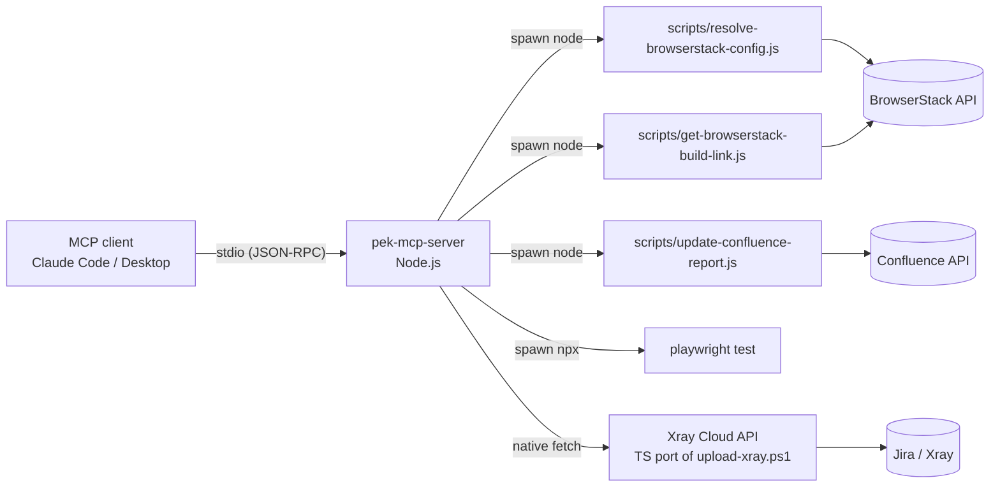
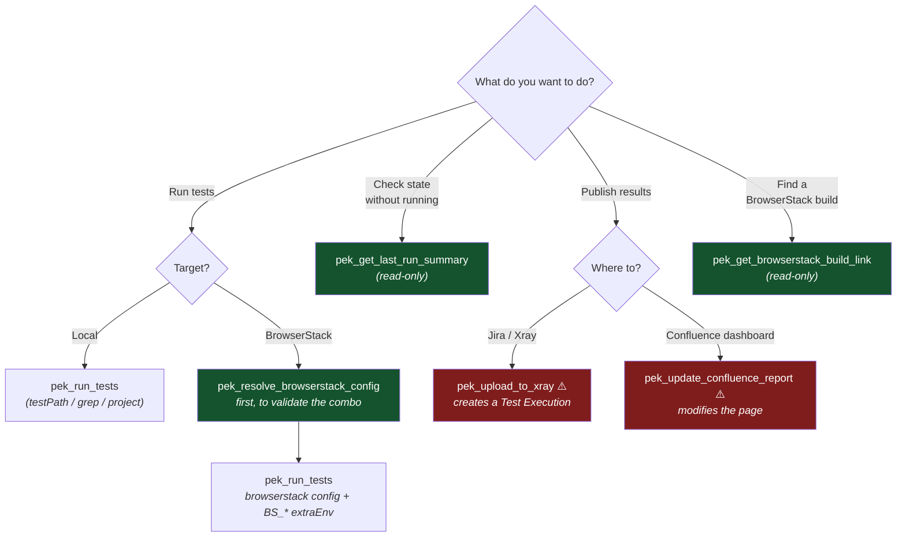

# PEK MCP Server — User Guide

> Version: 0.1.0 | Updated: 2026-07-08
> Applies to: `mcp-server/` in the Playwright Enterprise Kit repository
> Version française : [mcp-server-user-guide-fr.md](./mcp-server-user-guide-fr.md)

This guide explains, step by step, how to install, configure, and use the **PEK MCP Server** — the Model Context Protocol server that turns the Playwright Enterprise Kit's CI/CD workflows (Playwright runs, BrowserStack, Jira/Xray, Confluence) into tools an AI assistant can drive in natural language.

---

## Table of contents

1. [What it does](#1-what-it-does)
2. [How it works (architecture)](#2-how-it-works-architecture)
3. [Prerequisites](#3-prerequisites)
4. [Installation](#4-installation)
5. [Configuring your MCP client](#5-configuring-your-mcp-client)
6. [Environment variables reference](#6-environment-variables-reference)
7. [Tool reference](#7-tool-reference)
8. [End-to-end workflows](#8-end-to-end-workflows)
9. [Testing with MCP Inspector](#9-testing-with-mcp-inspector)
10. [Troubleshooting](#10-troubleshooting)
11. [Security model](#11-security-model)
12. [Known limits & roadmap](#12-known-limits--roadmap)

---

## 1. What it does

Once connected, you can tell your MCP client (Claude Code, Claude Desktop, or any MCP-compatible client):

> *"Run the smoke tests on Chrome latest / Windows 11 via BrowserStack, upload the results to Xray under Test Plan MYPROJECT-100, and update the Confluence dashboard."*

…and the assistant chains the right tools, using your existing kit scripts under the hood. No terminal, no copy-pasting of `BS_*` variables, no manual Xray upload.

The server exposes **6 tools**, all prefixed `pek_`:

| Tool | Purpose | Side effects |
|---|---|---|
| `pek_run_tests` | Run the Playwright suite | Local only (test artefacts) |
| `pek_get_last_run_summary` | Inspect last-run artefacts | None (read-only) |
| `pek_resolve_browserstack_config` | Validate an OS/browser combo via the BrowserStack API | None (read-only) |
| `pek_get_browserstack_build_link` | Find the Automate dashboard URL for a build | None (read-only) |
| `pek_upload_to_xray` | Upload JUnit results to Xray Cloud | **Creates a Jira Test Execution** |
| `pek_update_confluence_report` | Append a row to the Confluence dashboard | **Modifies a Confluence page** |

---

## 2. How it works (architecture)

The server is a thin, typed **façade** over the kit — the kit itself is unchanged.



Two design rules:

1. **Existing Node scripts stay the single source of truth.** The BrowserStack and Confluence tools *wrap* `scripts/*.js` via child processes; any fix you make to those scripts is automatically picked up by the MCP server.
2. **The only reimplementation is the Xray upload** (`src/services/xray.ts`), a TypeScript port of `scripts/upload-xray.ps1`, so the server runs identically on Windows, macOS, and Linux without a PowerShell dependency. Same API flow: `POST /api/v2/authenticate` → `POST /api/v2/import/execution/junit`, including the pre-upload cleanup of orphan `test_key` properties via `scripts/remove-test-keys.js`.

Source layout:

```
mcp-server/
├── package.json            # own dependency tree (SDK + zod), independent from the kit's
├── tsconfig.json           # strict mode, Node16 modules
├── README.md               # short version of this guide
└── src/
    ├── index.ts            # entry point: McpServer + stdio transport
    ├── constants.ts        # PEK_ROOT resolution, output limits, defaults
    ├── services/
    │   ├── exec.ts         # spawn helper (timeouts, output capture, JSON tail parsing)
    │   └── xray.ts         # Xray Cloud client (auth + JUnit import)
    └── tools/
        ├── tests.ts        # pek_run_tests, pek_get_last_run_summary
        ├── browserstack.ts # pek_resolve_browserstack_config, pek_get_browserstack_build_link
        ├── xray.ts         # pek_upload_to_xray
        └── confluence.ts   # pek_update_confluence_report
```

---

## 3. Prerequisites

| Requirement | Minimum | Notes |
|---|---|---|
| Node.js | 18+ | Native `fetch` and `AbortSignal.timeout` are used; 20/22 LTS recommended |
| Playwright Enterprise Kit | this repo, `npm install` done at the root | The server spawns `npx playwright test` from the kit root |
| An MCP client | Claude Code, Claude Desktop, or MCP Inspector | Any stdio-capable MCP client works |
| BrowserStack account | — | Only for the two BrowserStack tools and BrowserStack runs |
| Xray Cloud API key pair | client_id / client_secret | Only for `pek_upload_to_xray` — created in Xray > API Keys |
| Atlassian API token | — | Only for `pek_update_confluence_report` |

> The server itself has **no mandatory credentials**. Each tool tells you exactly which variable is missing if you call it unconfigured.

---

## 4. Installation

From the repository root:

```bash
cd mcp-server
npm install
npm run build
```

Expected result: a `dist/` folder with `dist/index.js` as the executable entry point.

Quick sanity check (the server logs its startup line on **stderr**, stdout is reserved for the MCP protocol):

```bash
node dist/index.js
# stderr → pek-mcp-server started (kit root: /path/to/playwright-enterprise-kit)
# Ctrl+C to stop
```

### Development mode

```bash
npm run dev      # tsc --watch, recompiles on save
```

---

## 5. Configuring your MCP client

### 5.1 Claude Code (recommended for this repo)

Create (or extend) a **`.mcp.json` at the repository root**. Claude Code auto-discovers it when you open the repo, and relative paths resolve from there:

```json
{
  "mcpServers": {
    "playwright-kit": {
      "command": "node",
      "args": ["mcp-server/dist/index.js"],
      "env": {
        "BROWSERSTACK_USERNAME": "your_bs_username",
        "BROWSERSTACK_ACCESS_KEY": "your_bs_access_key",
        "XRAY_CLIENT_ID": "your_xray_client_id",
        "XRAY_CLIENT_SECRET": "your_xray_client_secret",
        "JIRA_PROJECT_KEY": "MYPROJECT",
        "JIRA_URL": "https://yourco.atlassian.net",
        "CONFLUENCE_URL": "https://yourco.atlassian.net/wiki",
        "CONFLUENCE_USER": "you@yourco.com",
        "CONFLUENCE_API_TOKEN": "your_atlassian_token",
        "CONFLUENCE_SPACE_KEY": "QA"
      }
    }
  }
}
```

Alternatively, from a terminal inside the repo:

```bash
claude mcp add playwright-kit -- node mcp-server/dist/index.js
```

then add the environment variables in the generated config, or rely on variables already exported in your shell (the server inherits its parent environment).

> **Tip — keep secrets out of `.mcp.json`:** if the file is committed, leave `env` empty and export the secrets in your shell profile instead. `.mcp.json` with real credentials must be added to `.gitignore`.

Verify the connection inside Claude Code:

```
/mcp
```

You should see `playwright-kit` listed with 6 tools.

### 5.2 Claude Desktop

Edit `claude_desktop_config.json`:

- **Windows:** `%APPDATA%\Claude\claude_desktop_config.json`
- **macOS:** `~/Library/Application Support/Claude/claude_desktop_config.json`

Claude Desktop launches the server from an arbitrary working directory, so use an **absolute path** and set **`PEK_ROOT`** explicitly:

```json
{
  "mcpServers": {
    "playwright-kit": {
      "command": "node",
      "args": ["E:\\Code\\playwright-enterprise-kit\\mcp-server\\dist\\index.js"],
      "env": {
        "PEK_ROOT": "E:\\Code\\playwright-enterprise-kit",
        "BROWSERSTACK_USERNAME": "your_bs_username",
        "BROWSERSTACK_ACCESS_KEY": "your_bs_access_key",
        "XRAY_CLIENT_ID": "your_xray_client_id",
        "XRAY_CLIENT_SECRET": "your_xray_client_secret",
        "JIRA_PROJECT_KEY": "MYPROJECT",
        "CONFLUENCE_URL": "https://yourco.atlassian.net/wiki",
        "CONFLUENCE_USER": "you@yourco.com",
        "CONFLUENCE_API_TOKEN": "your_atlassian_token",
        "CONFLUENCE_SPACE_KEY": "QA"
      }
    }
  }
}
```

Restart Claude Desktop after editing. The tools appear under the 🔌 icon.

> On Windows JSON, backslashes must be doubled (`E:\\Code\\...`), or use forward slashes (`E:/Code/...`) — Node accepts both.

### 5.3 Any other MCP client

The server speaks standard MCP over **stdio**. Point your client at:

```
command: node
args:    [<absolute path>/mcp-server/dist/index.js]
env:     PEK_ROOT=<absolute path to the kit root> + credentials as needed
```

---

## 6. Environment variables reference

| Variable | Consumed by | Required? | Default | Notes |
|---|---|---|---|---|
| `PEK_ROOT` | all tools | No | parent directory of `mcp-server/` | **Set it whenever the client's working directory isn't the repo** (Claude Desktop, global installs) |
| `BROWSERSTACK_USERNAME` | BrowserStack tools, BrowserStack runs | For BrowserStack features | — | Without it, `pek_resolve_browserstack_config` falls back to the local version cache |
| `BROWSERSTACK_ACCESS_KEY` | idem | idem | — | |
| `XRAY_CLIENT_ID` | `pek_upload_to_xray` | Yes for Xray | — | Xray Cloud API key pair |
| `XRAY_CLIENT_SECRET` | `pek_upload_to_xray` | Yes for Xray | — | |
| `XRAY_ENDPOINT` | `pek_upload_to_xray` | No | `xray.cloud.getxray.app` | Change only for regional endpoints |
| `JIRA_PROJECT_KEY` | `pek_upload_to_xray` | If `projectKey` arg omitted | — | e.g. `MYPROJECT` |
| `JIRA_URL` | `pek_update_confluence_report` | No | derived from `CONFLUENCE_URL` | Used for Test Execution links in the dashboard |
| `CONFLUENCE_URL` | `pek_update_confluence_report` | Yes for Confluence | — | **Must end with `/wiki` on Atlassian Cloud** |
| `CONFLUENCE_USER` | idem | Yes for Confluence | — | Account email |
| `CONFLUENCE_API_TOKEN` | idem | Yes for Confluence | — | Atlassian API token |
| `CONFLUENCE_SPACE_KEY` | idem | Yes for Confluence | — | e.g. `QA` |
| `CONFLUENCE_PAGE_TITLE` | idem | No | `Test Execution Dashboard` | |
| `CONFLUENCE_PARENT_PAGE_ID` | idem | No | — | Parent page for auto-created dashboard |

---

## 7. Tool reference

Conventions used below:

- **Prompt examples** are things you can literally type to your assistant; it maps them to the tool.
- **Returns** describes the `structuredContent` payload every tool also emits alongside human-readable text.
- Read-only tools are safe to call at any time; tools with side effects are flagged.

Quick decision tree — also a good mental model of how the assistant picks a tool:



Green: side-effect-free tools, safe to call anytime. Red: tools that write to Jira or Confluence on every call.

---

### 7.1 `pek_run_tests`

Runs `npx playwright test` from the kit root and returns the outcome. Reporters declared in `playwright.config` are **not overridden**, so `xray-report.xml` (JUnit for Xray) and the HTML report keep being generated exactly as in CI.

**Parameters**

| Name | Type | Default | Description |
|---|---|---|---|
| `grep` | string | — | Only run tests whose title matches (maps to `--grep`), e.g. `"@smoke"` |
| `testPath` | string | — | File or directory relative to the repo root, e.g. `"tests/example/"` |
| `project` | string | — | Playwright project name (maps to `--project`) |
| `config` | string | — | Alternate config, e.g. `"playwright.config.browserstack.js"` |
| `headed` | boolean | `false` | Visible browser |
| `extraEnv` | object | — | Extra env vars for the run — typically the `BS_*` block from `pek_resolve_browserstack_config` |
| `timeoutSeconds` | number | `900` | Hard kill after this delay (30–7200) |

**Returns**

```json
{
  "exitCode": 0,
  "passed": 12, "failed": 0, "flaky": 0, "skipped": 1,
  "durationMs": 48211,
  "timedOut": false,
  "outputTail": "…last 6000 chars of the run output…"
}
```

**Prompt examples**

- *"Run the example tests"* → `{ testPath: "tests/example/" }`
- *"Run everything tagged @smoke, headed"* → `{ grep: "@smoke", headed: true }`
- *"Launch the BrowserStack config with these BS_ variables"* → `{ config: "playwright.config.browserstack.js", extraEnv: { …BS_* } }`

**Good to know**

- A non-zero exit code is reported in the summary, not thrown — the assistant can read failures and decide what to do next (re-run a subset, inspect `outputTail`, …).
- For long BrowserStack campaigns, raise `timeoutSeconds` explicitly (e.g. 3600).

---

### 7.2 `pek_get_last_run_summary` *(read-only)*

Checks the presence, timestamp and size of last-run artefacts, without executing anything:

- `xray-report.xml` — JUnit produced by `@xray-app/playwright-junit-reporter`
- `playwright-report/` — HTML report
- `test-results/` — traces, screenshots, videos

**Parameters:** none.

**Returns**

```json
{
  "artefacts": [
    { "name": "xray-report.xml", "path": "…", "exists": true,
      "modifiedAt": "2026-07-08T09:14:02.000Z", "sizeBytes": 18734 },
    …
  ]
}
```

**Prompt examples**

- *"Is there a fresh Xray report to upload?"*
- *"When did the last test run finish?"* (via `modifiedAt`)

**Typical use:** called by the assistant right before `pek_upload_to_xray` to confirm the JUnit file exists and is recent — avoiding an upload of stale results.

---

### 7.3 `pek_resolve_browserstack_config` *(read-only)*

Validates an OS/browser combination against the **live BrowserStack API** (with the kit's local fallback cache if the API is unreachable or credentials are absent) and returns the resolved environment block. Wraps `scripts/resolve-browserstack-config.js`.

**Parameters**

| Name | Type | Description |
|---|---|---|
| `os` | `"Windows"` \| `"Mac"` | Target OS |
| `osVersion` | string | `"11"`, `"10"` … / `"Sonoma"`, `"Sequoia"` … |
| `browser` | `"chrome"` \| `"chromium"` \| `"firefox"` \| `"safari"` \| `"edge"` | Target browser |
| `browserVersion` | string | `"latest"`, `"latest-1"`, `"131"` … (`latest*` patterns skip API validation) |

**Returns**

```json
{
  "BS_OS": "Windows",
  "BS_OS_VERSION": "11",
  "BS_BROWSER": "playwright-chromium",
  "BS_BROWSER_VERSION": "latest",
  "DEVICE_NAME": "windows-11-chrome-latest"
}
```

**Prompt examples**

- *"Is Safari 18 available on Sonoma?"*
- *"Prepare a config for Chrome latest on Windows 11"*

**Chaining:** feed the whole returned object into `pek_run_tests.extraEnv` together with `config: "playwright.config.browserstack.js"`. The `DEVICE_NAME` also feeds the Confluence dashboard row later.

**On validation failure** the tool returns the script's detailed error (available versions list), so the assistant can propose a valid alternative on its own.

---

### 7.4 `pek_get_browserstack_build_link` *(read-only)*

Looks up the BrowserStack Automate dashboard URL for a build by name. Match strategy is the script's: **exact → startsWith → contains**, falling back to the most recent build. Wraps `scripts/get-browserstack-build-link.js`.

**Parameters**

| Name | Type | Description |
|---|---|---|
| `buildName` | string | Build name as set in `browserstack.config` / CI |

**Returns**

```json
{ "buildUrl": "https://automate.browserstack.com/dashboard/v2/builds/<hashed_id>" }
```

**Prompt example**

- *"Give me the BrowserStack link for the last nightly build"*

**Requires:** `BROWSERSTACK_USERNAME` / `BROWSERSTACK_ACCESS_KEY`.

---

### 7.5 `pek_upload_to_xray` ⚠️ *creates a Jira Test Execution on every call*

Uploads a JUnit XML report to **Xray Cloud** and attaches the created Test Execution to an existing Jira Test Plan. TypeScript port of `scripts/upload-xray.ps1`, cross-platform. Before upload, orphan `test_key` properties are removed via `scripts/remove-test-keys.js` (same behaviour as the PowerShell original), so tests not yet declared in Jira don't break the import.

**Parameters**

| Name | Type | Default | Description |
|---|---|---|---|
| `testPlanKey` | string | — | Jira Test Plan key, validated as `PROJ-123` format |
| `projectKey` | string | env `JIRA_PROJECT_KEY` | Jira project key, validated as `PROJ` format |
| `reportPath` | string | `"xray-report.xml"` | JUnit file, relative to the repo root (absolute paths accepted) |
| `endpoint` | string | env `XRAY_ENDPOINT` or `xray.cloud.getxray.app` | Xray Cloud host |

**Returns**

```json
{
  "execKey": "MYPROJECT-142",
  "reportPath": "/…/xray-report.xml",
  "importUrl": "https://xray.cloud.getxray.app/api/v2/import/execution/junit?projectKey=…&testPlanKey=…"
}
```

**Prompt examples**

- *"Upload the results to Xray under Test Plan MYPROJECT-100"*
- *"Push last night's run to Jira"*

**Requires:** `XRAY_CLIENT_ID`, `XRAY_CLIENT_SECRET`.

**Not idempotent:** each call creates a *new* Test Execution in Jira. If the assistant proposes a second upload of the same report, that is a second execution in your project — decline unless intended.

---

### 7.6 `pek_update_confluence_report` ⚠️ *modifies a Confluence page on every call*

Appends an execution row to the **Test Execution Dashboard** Confluence page: result badge (green/red/grey), scope, OS/browser, links to the Jira Test Execution, the GitHub Actions run and the BrowserStack build. Creates the page if it doesn't exist; keeps the 50 most recent rows. Wraps `scripts/update-confluence-report.js`.

**Parameters**

| Name | Type | Default | Description |
|---|---|---|---|
| `testResult` | `"PASS"` \| `"FAIL"` \| `"UNKNOWN"` | — | Overall run result |
| `execKey` | string | — | Jira Test Execution key from `pek_upload_to_xray` |
| `testScope` | string | `"All Tests"` | Human-readable label |
| `browserstackUrl` | string (URL) | — | From `pek_get_browserstack_build_link` |
| `extraEnv` | object | — | Device context shown in the row: `DEVICE_NAME`, `BS_OS`, `BS_OS_VERSION`, `BS_BROWSER`, `BS_BROWSER_VERSION` |

**Returns**

```json
{ "pageUrl": "https://yourco.atlassian.net/wiki/spaces/QA/pages/123456" }
```

**Prompt example**

- *"Log this run as PASS on the Confluence dashboard, scope 'Smoke — Windows 11 Chrome'"*

**Requires:** `CONFLUENCE_URL` (ending in `/wiki` on Cloud), `CONFLUENCE_USER`, `CONFLUENCE_API_TOKEN`, `CONFLUENCE_SPACE_KEY`.

---

## 8. End-to-end workflows

### Workflow A — Local run + Xray

Prompt:

> *"Run the example tests; if they pass, upload the results to Xray under MYPROJECT-100."*

What the assistant chains:

```
pek_run_tests { testPath: "tests/example/" }
        │  exitCode 0, 12 passed
        ▼
pek_get_last_run_summary          # confirms xray-report.xml is fresh
        ▼
pek_upload_to_xray { testPlanKey: "MYPROJECT-100" }
        │  execKey: MYPROJECT-142
        ▼
"Done — Test Execution MYPROJECT-142 created."
```

### Workflow B — Full BrowserStack chain (the flagship scenario)

Prompt:

> *"Run the smoke tests on Chrome latest / Windows 11 via BrowserStack, upload to Xray under MYPROJECT-100, and update the Confluence dashboard with the BrowserStack link."*

```
pek_resolve_browserstack_config { os: "Windows", osVersion: "11",
                                  browser: "chrome", browserVersion: "latest" }
        │  { BS_OS…, DEVICE_NAME: "windows-11-chrome-latest" }
        ▼
pek_run_tests { grep: "@smoke",
                config: "playwright.config.browserstack.js",
                extraEnv: { BS_OS…, DEVICE_NAME }, timeoutSeconds: 3600 }
        ▼
pek_upload_to_xray { testPlanKey: "MYPROJECT-100" }        → execKey
        ▼
pek_get_browserstack_build_link { buildName: "<build name>" } → buildUrl
        ▼
pek_update_confluence_report { testResult: "PASS", execKey,
                               testScope: "Smoke — Win11 Chrome latest",
                               browserstackUrl: buildUrl,
                               extraEnv: { BS_OS…, DEVICE_NAME } }
        ▼
"Dashboard updated: <pageUrl>"
```

### Workflow C — Failure triage without re-running

Prompt:

> *"Did the last run leave anything to upload? If the report is older than today, re-run the regression subset first."*

The assistant uses `pek_get_last_run_summary` (timestamps), decides, and only then calls `pek_run_tests` if needed — a good example of why the read-only tools exist.

---

## 9. Testing with MCP Inspector

MCP Inspector is the fastest way to exercise tools manually, outside any assistant:

```bash
cd mcp-server
npm run inspect
```

This opens a local web UI where you can:

1. See the 6 tools with their JSON schemas and annotations (`readOnlyHint`, etc.)
2. Fill parameters in a form and call each tool
3. Inspect both the text output and the `structuredContent`

Recommended first calls, in order of increasing risk:

1. `pek_get_last_run_summary` — no credentials needed, validates `PEK_ROOT`
2. `pek_resolve_browserstack_config` — validates BrowserStack credentials (or exercises the fallback cache)
3. `pek_run_tests` with `testPath: "tests/example/"` — validates the Playwright toolchain
4. Only then the two write tools, on a sandbox Jira project / Confluence space

---

## 10. Troubleshooting

| Symptom | Likely cause | Fix |
|---|---|---|
| Client shows the server as "failed to start" | `dist/index.js` missing | Run `npm run build` in `mcp-server/` |
| Tools work but operate on the wrong directory | `PEK_ROOT` not set and client launched the server from elsewhere | Set `PEK_ROOT` in the client's `env` block (mandatory with Claude Desktop) |
| `pek_run_tests` returns `exitCode: null` with "Failed to start process 'npx'" | Node/npm not on the PATH seen by the client | Launch the client from a shell with Node on PATH, or use the absolute path to `npx` |
| `pek_run_tests` reports `timedOut: true` | Campaign longer than `timeoutSeconds` | Pass a larger `timeoutSeconds` (up to 7200) |
| `pek_resolve_browserstack_config` warns "using local fallback cache" | Missing BrowserStack credentials or API unreachable | Set `BROWSERSTACK_USERNAME` / `BROWSERSTACK_ACCESS_KEY`; the fallback remains usable but may lag behind real availability |
| `pek_upload_to_xray` → "Xray authentication failed (401)" | Bad `XRAY_CLIENT_ID` / `XRAY_CLIENT_SECRET` | Regenerate the API key pair in Xray > API Keys |
| `pek_upload_to_xray` → "JUnit report not found" | Tests not run yet, or reporter not configured | Run `pek_run_tests` first; check `@xray-app/playwright-junit-reporter` in `playwright.config` |
| `pek_update_confluence_report` → "Received HTML instead of JSON" | `CONFLUENCE_URL` missing the `/wiki` suffix (Atlassian Cloud) | Use `https://yourco.atlassian.net/wiki` |
| Server prints nothing on stdout when run manually | Expected — stdout is the MCP protocol channel | Startup/status logs go to **stderr** |
| Windows: JSON config rejected | Unescaped backslashes in paths | Double them (`E:\\Code\\…`) or use forward slashes |

---

## 11. Security model

- **Credentials never transit through the model.** They live in the MCP client configuration (or your shell environment), are read by the *server process*, and are injected into child processes / API calls. Tool inputs and outputs never contain them.
- **`.mcp.json` with real secrets must never be committed.** Prefer shell-exported variables for anything shared; if you keep secrets in the file, add it to `.gitignore`.
- **Write operations are explicit and labelled.** Only two tools mutate remote systems (`pek_upload_to_xray`, `pek_update_confluence_report`); both are annotated as non-read-only and non-idempotent, so well-behaved MCP clients ask for confirmation before calling them.
- **Scoped tokens.** Use an Atlassian API token limited to the target Confluence space, and an Xray key pair scoped to the target project where your instance allows it.
- **No arbitrary command execution.** `pek_run_tests` only assembles `npx playwright test` arguments from validated, typed parameters; there is no generic "run shell command" tool.

---

## 12. Known limits & roadmap

| Limit (v0.1.0) | Impact | Candidate for |
|---|---|---|
| `pek_run_tests` is synchronous | Very long campaigns block the tool call until `timeoutSeconds` | v0.2 — async pattern: `pek_start_run` → `run_id` + `pek_get_run_status` |
| Summary parsed from the list reporter's output | Counters depend on the reporter's textual summary; exotic reporter configs could yield zeros (exit code stays reliable) | v0.2 — optional JSON reporter side-channel |
| `jira-post-execution.ps1` and `add-timestamps-to-xray-report.js` not exposed | Those steps stay CI-only | v0.2 — additional tools if the need shows up |
| stdio transport only | No remote/multi-client access | v0.3 — optional streamable HTTP mode |

---

*Back to: [mcp-server/README.md](../mcp-server/README.md) · [Repository README](../README.md) · [Version française](./mcp-server-user-guide-fr.md)*
